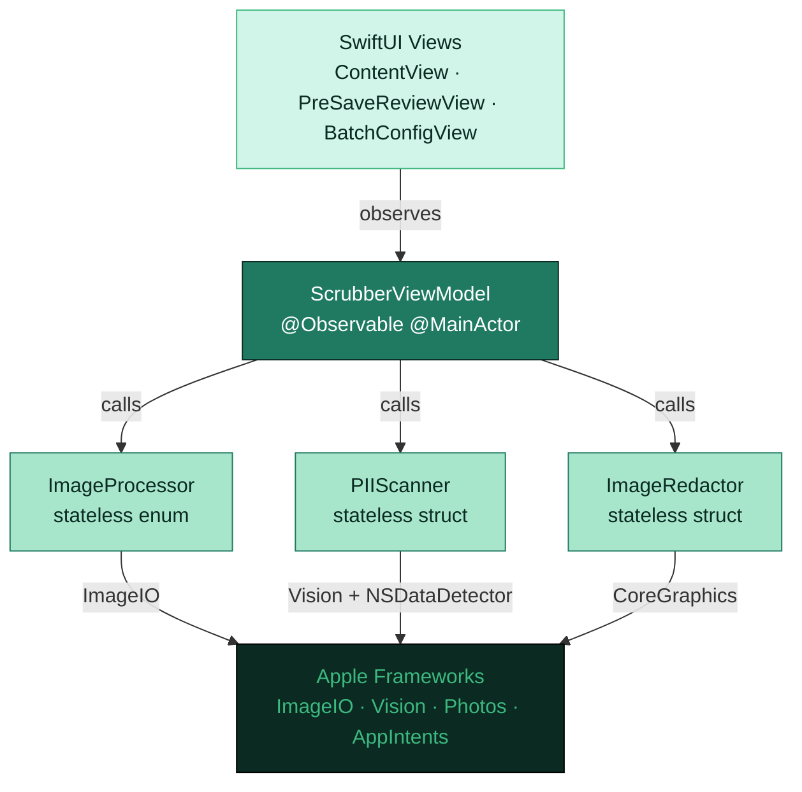
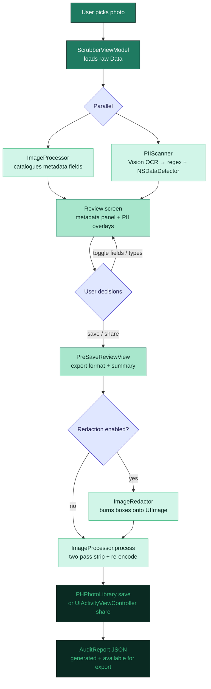

<div align="center">
  

# PicStrip

[](https://www.apple.com/ios/)
[](https://swift.org)
[](https://github.com/northcutted/picstrip/actions)
[](LICENSE)

**Your photos, your privacy. Strip metadata and redact sensitive text — 100% on your device.**

</div>

PicStrip removes EXIF location data, camera metadata, and visually redacts personally identifiable information (PII) from photos before you share them. Every byte of processing happens locally using Apple frameworks. No network calls, no analytics, no third-party code.

---

## Screenshots

The App Store carousel and the marketing PNGs uploaded to App Store Connect live in [`fastlane/screenshots/processed/<locale>/`](fastlane/screenshots/processed/) (Git LFS — 5 screens × 2 devices × 16 locales). Raw simulator captures live in [`fastlane/screenshots/<locale>/`](fastlane/screenshots/). Both regenerate via `gh workflow run screenshots.yml -f generate_new=true`.

---

## What PicStrip Does

| Feature | Description |
|---------|-------------|
| **Metadata Stripping** | Removes GPS, EXIF, EXIF Auxiliary, TIFF, IPTC, and Apple Maker Note metadata |
| **Visual PII Detection** | On-device OCR and Vision scan image content for 30 sensitive data types across 4 risk tiers (Critical, High, Medium, Low) |
| **Visual PII Redaction** | Solid, blur, or pixelate redactions with 10 color options; multi-select bulk operations; 50-step undo/redo |
| **Files & Drag-and-Drop** | Import from Photos library, Files app, or drag and drop directly into the app |
| **Batch Processing** | Clean multiple photos at once with a uniform privacy policy |
| **Save or Replace** | Save a new cleaned asset, or replace the original in your Photos library |
| **Flexible Export** | PNG (privacy default), JPEG, HEIC, or match original format |
| **Per-Field Control** | Fine-grained toggles for individual metadata fields and PII types |
| **Audit Reports** | Export a JSON audit of every stripped field and redacted region |
| **Share Extension** | Clean photos directly from the iOS share sheet without opening the app |
| **Siri Shortcuts** | "Clean Photos with PicStrip" intent integrates with Shortcuts and Spotlight |

---

## Why It's Interesting

**Two-pass ImageIO privacy pipeline.**
A single-pass re-encode still triggers iOS to auto-synthesise a minimal EXIF block (ColorSpace, PixelDimensions). PicStrip defeats this with a deliberate two-pass strategy: pass 1 decodes pixels and force-zeros the EXIF/TIFF dictionaries; pass 2 uses `CGImageDestinationCopyImageSource` with `kCGImageDestinationMergeMetadata: false` to replace the entire metadata tree with only what the user explicitly chose to keep. The result is provably clean output, not "mostly clean."

**Orientation-safe OCR.**
PII bounding boxes must land on the right pixels regardless of how the photo was captured. PicStrip passes raw `Data` (not a pre-decoded `CGImage`) to `VNImageRequestHandler` so Vision reads the embedded EXIF orientation tag. Passing a decoded `CGImage` strips that tag, causing highlight boxes to land in the wrong position for any portrait-mode iPhone photo.

**Sequential memory-safe batch processing.**
Each image in a batch is processed, saved, and explicitly deallocated before the next one begins. This keeps peak memory at ~one image at a time rather than accumulating a full batch in RAM, which matters on constrained devices and inside the share extension's 120 MB process ceiling.

**Preview memory discipline.**
PicStrip keeps full-resolution source bytes for export, but decodes bounded ImageIO thumbnails for display and review. Heavy encode/decode work runs off the MainActor, then the view model publishes only final state back to SwiftUI.

**Layered PII detection across 30 types.**
Three detectors run per OCR observation: a regex rules engine (`DetectionRegistry.allRules`, compiled once at startup) fires first with higher base scores; a reused `NSDataDetector` covers phone numbers, addresses, and links; a cross-observation heuristic catches split credential labels (e.g., a "Password:" label on one line and the value on the next). Face and barcode detection run as separate Vision requests (`VNDetectFaceRectanglesRequest`, `VNDetectBarcodesRequest`). Face detection uses temporary on-device rectangles only; PicStrip does not identify people, create biometric templates, transmit face data, or retain face data after the current photo/session is cleared. Each match is scored as `baseScore × ocrConfidence`; the highest score per type wins. Every type carries a static `RiskLevel` (critical / high / medium / low) that is independent of detection confidence.

**Zero runtime third-party dependencies.**
Every framework is Apple-native: `ImageIO`, `Vision`, `Photos`, `PhotosUI`, `AppIntents`, `CoreGraphics`, `UIKit`, `SwiftUI`. No package manager dependencies appear in the final binary.

---

## Architecture



### Design pattern: MVVM

| Layer | Type | Notes |
|-------|------|-------|
| `ScrubberViewModel` | `@Observable @MainActor final class` | Owns all mutable state; drives the full data-flow pipeline |
| `ImageProcessor` | `enum` (stateless, static methods) | Two-pass metadata stripping; re-encodes via `ImageIO` |
| `PIIScanner` | `struct` (stateless) | Async; offloads Vision OCR to `Task.detached` |
| `ImageRedactor` | `struct` (stateless) | Burns redaction boxes via `UIGraphicsImageRenderer` |
| `DetectionRegistry` | `enum` (static `let`) | All regex rules compiled once at app startup |

---

## Processing Flow



---

## PII Detection — 30 Types

| Risk | Type | Detection method |
|------|------|-----------------|
| **Critical** | Social Security Number | Regex (`XXX-XX-XXXX`) |
| **Critical** | National Insurance Number | Regex |
| **Critical** | Government ID | Regex (CA SIN, IN PAN/Aadhaar, ES DNI/NIE, BR CPF, DE Steuer-ID, IT Codice Fiscale, FR INSEE, JP My Number) |
| **Critical** | Credit Card Number | Regex (Luhn-pattern) |
| **Critical** | AWS Access Key | Regex (`AKIA…`) |
| **Critical** | GitHub Token | Regex (`ghp_…`) |
| **Critical** | Google API Key | Regex |
| **Critical** | OpenAI API Key | Regex |
| **Critical** | Slack Token | Regex (`xox…`) |
| **Critical** | Stripe Key | Regex |
| **Critical** | Private Key | Regex (PEM header) |
| **Critical** | JWT Token | Regex (double `eyJ` header) |
| **Critical** | Developer Secret | Regex (Anthropic, GitLab PAT, npm, HuggingFace, DigitalOcean, Twilio, SendGrid, Discord) |
| **Critical** | Database Connection String | Regex (inline credentials in URI) |
| **High** | Face | Vision `VNDetectFaceRectanglesRequest` |
| **High** | IBAN | Regex |
| **High** | ABA Routing Number | Regex + context keyword (`routing`, `ABA`) |
| **High** | SWIFT / BIC Code | Regex + context keyword |
| **High** | Physical Credential / Password | Cross-observation heuristic |
| **Medium** | Email Address | Regex (RFC 5322) + `NSDataDetector` |
| **Medium** | Phone Number | `NSDataDetector` |
| **Medium** | Address | `NSDataDetector` |
| **Medium** | Crypto Wallet Address | Regex |
| **Medium** | Vehicle Identification Number | Regex (17-char, no I/O/Q) |
| **Medium** | License Plate Number | Regex (structural CA-style + keyword fallback for regional formats) |
| **Medium** | MAC Address | Regex |
| **Medium** | IP Address | Regex |
| **Low** | Date of Birth | Regex |
| **Low** | Link / URL | `NSDataDetector` |
| **Low** | QR Code / Barcode | Vision `VNDetectBarcodesRequest` |

Each match is scored as `baseScore × ocrConfidence`. The result-level score upgrades when a later pass finds a stronger hit for the same type, ensuring the regex pass (higher base scores) always wins over `NSDataDetector` for overlapping types such as email. Risk level is a static, editorial property of the type itself — it does not change with confidence score.

---

## Metadata Categories Stripped

| Category | Example fields |
|----------|----------------|
| **GPS** | `GPSLatitude`, `GPSLongitude`, `GPSAltitude`, `GPSTimestamp` |
| **EXIF** | `DateTimeOriginal`, `Make`, `Model`, `LensMake`, `ExposureTime`, `FNumber` |
| **EXIF Auxiliary** | `LensInfo`, `InternalSerialNumber` |
| **TIFF** | `ImageDescription`, `Make`, `Model`, `Software`, `DateTime` |
| **IPTC** | `Keywords`, `Copyright`, `Creator`, `CaptionAbstract` |
| **Apple Maker Note** | Private Apple camera tuning data |

Structural rendering fields (`PixelWidth`, `PixelHeight`, `ColorModel`, `Orientation`, `XResolution`, `YResolution`) are re-synthesised unconditionally by the iOS encoder and are not privacy-sensitive. The UI marks them with a lock icon and explains why they cannot be removed.

---

## Repo Map

```
PicStrip/
├── PicStrip.xcodeproj/
├── README.md
├── DEVELOPMENT.md
├── PRIVACY.md
├── CHANGELOG.md
├── LICENSE
├── .swiftlint.yml
├── .releaserc.json          # semantic-release config
├── Gemfile                  # fastlane + Ruby toolchain
├── package.json             # semantic-release Node toolchain
│
├── .github/workflows/
│   ├── pr.yml               # PR checks: lint, analyze, test
│   ├── main.yml             # Release prep: version → QA → build → provenance → TestFlight → tag
│   ├── app-store-deploy.yml # Tag deploy: verify handoff, then request review
│   ├── metadata-only.yml    # Manual App Store metadata amendments
│   └── screenshots.yml      # Manual: capture App Store screenshots
│
├── fastlane/
│   ├── Fastfile             # Lane definitions
│   ├── Snapfile             # Devices (iPhone 17 Pro Max + iPad Pro 13") + 16 capture locales
│   ├── MarketingHeadlines.xcstrings  # Localized headline copy for marketing screenshots
│   ├── accessibility_declarations.json  # App Store Accessibility Nutrition Label config
│   ├── screenshots/
│   │   ├── manifest.json    # Expected raw-capture filename inventory
│   │   ├── <locale>/        # Raw App Store captures, one folder per locale (16 locales)
│   │   └── processed/       # Marketing PNGs uploaded to App Store Connect (Git LFS)
│   │       └── <locale>/    # 5 screens × 2 devices, framed + composed per locale
│   └── metadata/            # App Store metadata (title, description, keywords, release notes)
│
├── scripts/
│   ├── process_screenshots.py  # Marketing compositor: custom frame + headline + brand gradient
│   ├── requirements.txt        # Python deps for the compositor (Pillow, arabic-reshaper, python-bidi)
│   ├── semantic_dry_run.mjs    # Semantic-release dry-run JSON writer for release prep
│   ├── render_app_store_metadata.sh  # Applies generated notes to App Store metadata artifacts
│   ├── translate_xcstrings.js  # Localization automation (pseudo + OpenAI providers)
│   └── audit_localization_strings.sh  # Hard-coded-string audit for shared core/extension code
│
├── docs/
│   ├── icons/               # Generated app icon variants (Default, Dark, Tinted)
│   └── marketing/           # App Store marketing copy + index
│
├── PicStripCore/            # Shared pure processing/domain code compiled into app + extension
│   ├── ImageProcessor.swift
│   ├── PIIScanner.swift
│   ├── ImageRedactor.swift
│   ├── DetectionModels.swift
│   ├── DetectionRule.swift
│   ├── PIIType.swift
│   └── ExportPreset.swift
│
├── PicStrip/                # Main app target
│   ├── PicStripApp.swift
│   ├── ContentView.swift
│   ├── ScrubberViewModel.swift
│   ├── AuditReport.swift
│   ├── AboutView.swift
│   ├── PreSaveReviewView.swift
│   └── PrivacyInfo.xcprivacy
│
├── PicStripShareExtension/  # Share Extension target (separate binary)
│   ├── ShareViewController.swift   # UIKit host + UIHostingController
│   └── PrivacyInfo.xcprivacy
│
├── PicStripTests/           # Unit tests
│   ├── PIIScannerTests.swift
│   ├── ImageProcessorTests.swift
│   └── DetectionRegistryTests.swift
│
└── PicStripUITests/         # UI / screenshot tests
    └── PicStripUITests.swift        # single testAllScreenshots() method
```

---

## Local Setup

### Run the app

```bash
git clone https://github.com/northcutted/picstrip.git
cd picstrip
open PicStrip.xcodeproj
```

1. Select the **PicStrip** target → **Signing & Capabilities** → change **Team** to your Apple Developer account.
2. Repeat for **PicStripShareExtension**.
3. Select an iPhone 17 simulator (or a physical device running iOS 17+).
4. Press **Cmd + R**.

### Contributor / release tooling

The CI pipeline requires Ruby (Fastlane) and Node (semantic-release).

```bash
# Ruby toolchain (Fastlane)
gem install bundler
bundle install          # installs fastlane ~> 2.233

# Node toolchain (semantic-release)
npm install
```

---

## Developer Commands

| Command | What it does |
|---------|--------------|
| `make help` | Lists local helper commands |
| `make test` | Runs `bundle exec fastlane test` |
| `make build` | Runs `bundle exec fastlane build` |
| `make audit-localization` | Checks shared core/extension string-returning code for literals that should use localization helpers |
| `make localization-export` | Exports Xcode `.xcloc` localization packages to `build/localization-export/` |
| `make localization-pseudo LANGUAGES="es fr"` | Fills missing `.xcstrings` localizations with `[lang] source` markers for layout smoke testing |
| `make localization-validate` | Validates string catalog JSON, the localization audit, and SwiftLint |
| `make test-fixture` | Regenerates the OCR test fixture (`PicStripUITests/test_list.png`) via `scripts/make_fixture.py` |
| `make screenshots` | Runs the full screenshot capture; pass `DEVICE="iPhone 17 Pro Max"` or `DEVICES="iPhone 17 Pro Max,iPad Pro 13-inch (M5)"` for subsets |
| `make process-screenshots` | Composes marketing PNGs from existing raw captures into `fastlane/screenshots/processed/<locale>/` (custom frame + brand gradient + localized headline) |
| `make upload-screenshots` | Composes (via `process-screenshots`) and uploads the full local screenshot set; pass `ALLOW_PARTIAL=true` only when intentionally uploading an incomplete set |
| `bundle exec fastlane lint` | SwiftLint strict mode — fails on any warning |
| `bundle exec fastlane analyze` | `xcodebuild analyze` static analysis |
| `bundle exec fastlane test` | `PicStripTests` unit tests on iPhone 17 simulator; outputs JUnit XML to `build/test_output/` |
| `bundle exec fastlane build` | Signs + exports IPA (requires App Store certificates) |
| `bundle exec fastlane beta` | `certificates` → `build` → TestFlight upload |
| `bundle exec fastlane upload_testflight` | Uploads an existing IPA path (`IPA_PATH` or `build/PicStrip.ipa`) to TestFlight |
| `bundle exec fastlane screenshots` | Captures App Store screenshots (reads `fastlane/Snapfile`); pass `device:"iPhone 17 Pro Max"` to limit the device matrix or `languages:"en-US,de-DE"` to limit the locale subset |
| `bundle exec fastlane process_screenshots` | Runs the Python compositor over every locale present under `fastlane/screenshots/<locale>/` |
| `bundle exec fastlane upload_screenshots` | Uploads the marketing PNGs in `fastlane/screenshots/processed/` to App Store Connect; refuses partial sets unless `allow_partial:true` is passed |
| `bundle exec fastlane app_store_stage` | Stages metadata, screenshots, declarations, and the selected TestFlight build without submitting |
| `bundle exec fastlane request_review` | Requests App Review for the already-staged version |

---

## Localization

PicStrip uses Apple string catalogs:

- `PicStrip/Localizable.xcstrings` — runtime app + extension copy
- `PicStrip/AppShortcuts.xcstrings` — Siri / Shortcuts phrases
- `fastlane/MarketingHeadlines.xcstrings` — App Store screenshot headlines

**Translations are LLM-generated.** English is the canonical source; the catalog and `fastlane/metadata/<locale>/` entries are filled in from there. If a translation reads off, edit it inline in the matching catalog or `.txt` file — every locale is editable directly without round-tripping through a translator.

For layout smoke testing — exercising the UI against longer strings, RTL mirroring, and non-ASCII glyphs *before* the real translations land — use the pseudo-localizer:

```bash
make localization-pseudo LANGUAGES="es"     # writes [es] <source> into missing slots
make localization-validate                  # JSON + SwiftLint + hard-coded-string audit
```

Pseudo entries should be replaced with real translations before release.

Use Xcode's localization package flow when handing strings to a human translator:

```bash
make localization-export
```

---

## CI/CD Pipeline

- **PRs** — `pr.yml` runs SwiftLint (strict), `xcodebuild analyze`, and unit tests in parallel. An optional `screenshots`-labelled job captures the full 2-device set as a PR artifact.
- **Releases** — `main.yml` performs release prep from `main`: semantic dry-run, QA evidence, signed IPA, SBOMs, attestations, SLSA Level 3 provenance, TestFlight upload, and final `vX.Y.Z` tag/release creation. The tag triggers `app-store-deploy.yml`, which stages repo metadata/screenshots/build in App Store Connect, then waits for manual approval before submitting the current draft as-is.
- **Screenshots** — `screenshots.yml` is manually dispatched. The fast path uploads the committed marketing PNGs from Git LFS; `generate_new=true` regenerates them by capturing fresh simulator screenshots and running the Python compositor (custom frame, brand gradient, localized headline per locale).

See [DEVELOPMENT.md → CI/CD Pipeline](DEVELOPMENT.md#cicd-pipeline) for the full job graph, fastlane lanes, and screenshot compositor details.

---

## Privacy

### 100% on-device

- No internet required
- No analytics or tracking
- No data collection
- No remote servers

Every step runs locally: `UIImage(data:)` decoding, `ImageIO` metadata extraction and re-encoding, Vision OCR, `NSRegularExpression` matching, `CoreGraphics` redaction rendering. Network Inspector in Xcode will show zero outbound connections.

### Privacy manifest

Both the main app and the share extension declare zero data collection and zero tracking domains in `PrivacyInfo.xcprivacy`. The only required-reason API used is `NSPrivacyAccessedAPICategoryFileTimestamp` (`C617.1`) for ImageIO file timestamp access during metadata extraction — not for fingerprinting.

### Permissions

| Permission | When |
|-----------|------|
| `NSPhotoLibraryAddUsageDescription` (add-only) | Saving a new cleaned asset |
| `NSPhotoLibraryUsageDescription` (read + write) | "Replace Original" — needs read access to delete the source |

---

## Supply Chain Security (SLSA Level 3)

Every release ships with SLSA Build Level 3 provenance for the GitHub-built `PicStrip.ipa`, cryptographically proving the IPA was produced by GitHub Actions (not a developer's machine) with no post-build tampering. TestFlight upload is gated on attestation verification against the exact workflow source commit.

This claim applies to the GitHub-built IPA attached to the release. It does not claim that the same digest identifies the App Store-installed app, because Apple may re-sign, encrypt, or thin the distributed binary.

See [DEVELOPMENT.md → SLSA Build Provenance Level 3](DEVELOPMENT.md#slsa-build-provenance-level-3) for the `gh attestation verify` and `slsa-verifier` commands and the threat-model details.

---

## App Store

PicStrip is available on the App Store.

[](https://apps.apple.com/app/picstrip/id6765989071)

---

## Requirements

| | |
|-|-|
| **iOS** | 17.0+ |
| **Xcode** | 16.0+ (Xcode 26 on CI) |
| **Swift** | 5.9+ |
| **macOS** | 14.0+ (for development) |
| **Apple Developer Account** | Required for signing and share extension entitlements |

---

## Contributing

See [DEVELOPMENT.md](DEVELOPMENT.md) for architecture details, data-flow diagrams, the PII detection deep-dive, and step-by-step instructions for adding a new PII type.

Commits follow [Conventional Commits](https://www.conventionalcommits.org/):
- `feat:` — minor version bump
- `fix:` / `perf:` / `revert:` — patch bump
- `BREAKING CHANGE:` — major bump

---

## License

MIT. See [LICENSE](LICENSE).

---

## Support

- Open an [Issue](https://github.com/northcutted/picstrip/issues)
- Start a [Discussion](https://github.com/northcutted/picstrip/discussions)
