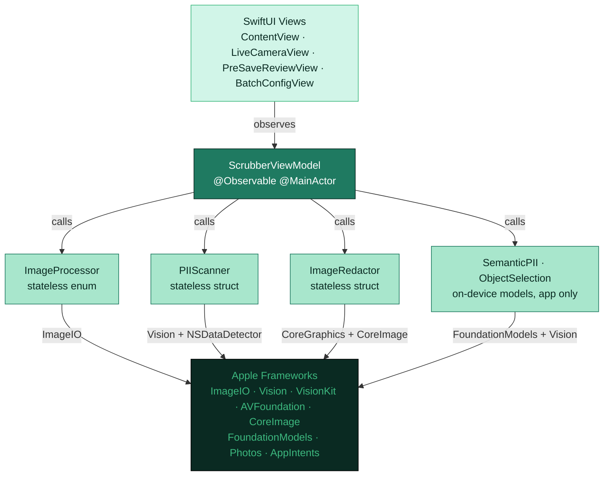

<div align="center">
  

# PicStrip

[](https://www.apple.com/ios/)
[](https://swift.org)
[](https://github.com/northcutted/picstrip/actions)
[](LICENSE)

**Your photos, your privacy. Strip metadata and redact sensitive text — 100% on your device.**

</div>

PicStrip removes EXIF location data, camera metadata, and visually redacts personally identifiable information (PII) from photos before you share them. Every byte of processing happens locally using Apple frameworks. No network required, no analytics, no third-party code.

---

## Screenshots

<p align="center">
  
  
  
</p>

---

## What PicStrip Does

| Feature | Description |
|---------|-------------|
| **Metadata Stripping** | Removes GPS, EXIF, EXIF Auxiliary, TIFF, IPTC, and Apple Maker Note metadata, with per-field control over what to keep |
| **Visual PII Detection** | On-device OCR and Vision find 31 kinds of sensitive data across 4 risk tiers (Critical, High, Medium, Low) |
| **Name Detection** | Where Apple Intelligence is on, Apple's on-device language model finds people's names — listed, off by default, never Private Cloud Compute |
| **Redaction Editor** | Solid, crosshatch, pixelate, or blur in 12 colors, with adjustable blur and pixelate strength, previewed live in the editor; move, resize, draw your own boxes; multi-select bulk edits; 50-step undo/redo |
| **Tap to Redact** | On iOS 27, tap an object and PicStrip boxes it for you (uses an Apple model that iOS downloads once, only after you agree) |
| **Take Photo** | A viewfinder that shows, live, what will be redacted; the photo goes straight into the editor and the original never reaches your photo library |
| **Scan Document** | Scan paper straight into the editor; multi-page scans go through batch. The un-redacted scan is never saved |
| **Import Anywhere** | Photos, Files, paste, drag and drop — always the original bytes, metadata intact |
| **Batch Processing** | Clean many photos at once with one privacy policy; nothing is saved unless every requested step succeeded |
| **Save, Replace, Share** | Save a cleaned copy, replace the original, or share; PNG (privacy default), JPEG, HEIC, or the original format |
| **Audit Reports** | Export a JSON record of every stripped field and redacted region |
| **Share Extension** | Clean photos from the share sheet without opening the app |
| **Shortcuts** | "Clean Photos with PicStrip" opens the picker; "Strip Metadata from Images" cleans files in the background |

Available in English and 16 more localizations, including separate Spanish for Spain and Latin America.

---

## Privacy

- **No network required.** PicStrip has no server and no account, and makes no network request of its own.
- No analytics, no tracking, no data collection, no third-party code.
- Names are found by Apple's **on-device** language model only — never Private Cloud Compute — and are not redacted until you switch them on.
- The "Take Photo" viewfinder analyses frames in memory to show what would be redacted; no frame and no result is stored.
- Photos you take or scan in the app never reach your photo library un-redacted.
- One opt-in exception to "no network": on iOS 27, iOS downloads Apple's object-selection model the first time you agree to use tap to redact — the model only, never your photos.

The full statement is in [PRIVACY.md](PRIVACY.md); the privacy manifest, permissions and required-reason APIs are covered in [DEVELOPMENT.md](DEVELOPMENT.md#privacy--security).

---

## How It Works



**A two-pass ImageIO pipeline.** A single re-encode still lets iOS synthesise a minimal EXIF block. PicStrip decodes and zeroes the EXIF/TIFF dictionaries, then uses `CGImageDestinationCopyImageSource` with `kCGImageDestinationMergeMetadata: false` to replace the whole metadata tree with only what you chose to keep.

**Layered detection.** One `ImageRequestHandler(data).performAll(...)` pass runs text, face, barcode and document-rectangle requests; 60 regex rules, `NSDataDetector` and a cross-line credential heuristic work over the recognised text; checksums adjust confidence; document context boosts what belongs on a card or ID. Raw `Data` — not a decoded image — goes to Vision, so boxes land correctly whatever the photo's orientation.

**Zero runtime third-party dependencies.** Every framework is Apple's. Details, data flows and the full detection catalog are in [DEVELOPMENT.md](DEVELOPMENT.md).

---

## Run It

```bash
git clone https://github.com/northcutted/picstrip.git
cd picstrip
open PicStrip.xcodeproj
```

1. Select the **PicStrip** target → **Signing & Capabilities** → set **Team** to your Apple Developer account. Repeat for **PicStripShareExtension**.
2. Pick an iPhone 17 simulator, or a device running iOS 26 or later. The camera, document scanner and tap to redact need a real device.
3. Press **Cmd + R**.

| | |
|-|-|
| **iOS** | 26.0+ (tap to redact needs iOS 27; name detection needs Apple Intelligence) |
| **Xcode** | 27.0 (26.6 is the pinned compatibility build; iOS 27-only code compiles out below Swift 6.4) |
| **Swift** | Swift 6 language mode |
| **Apple Developer Account** | Required for signing and the share extension's App Group |

---

## Developer Commands

| Command | What it does |
|---------|--------------|
| `make help` | Lists every helper command |
| `make test` | Unit tests on the iPhone 17 simulator |
| `make lint` | SwiftLint (strict) plus the string catalog audit |
| `make audit-localization` | Finds unlocalized literals and catalog gaps (every key in all 16 localizations, placeholders intact, plural forms complete) |
| `make screenshots` | App Store screenshot capture; `DEVICE=` / `DEVICES=` select a subset |

Releases run through a pinned public iOS release platform that targets SLSA Build Level 3 for the GitHub-built IPA; see the [release operations guide](docs/release-pipeline.md). Translations are LLM-generated from the English source and edited inline; the rules and per-locale terms are in [DEVELOPMENT.md](DEVELOPMENT.md#localization) and the [localization glossary](docs/localization-glossary.md).

---

## Contributing

See [DEVELOPMENT.md](DEVELOPMENT.md) for the architecture, data flows, the detection engine, and how to add a new PII type.

Commits follow [Conventional Commits](https://www.conventionalcommits.org/): `feat:` bumps the minor version, `fix:` / `perf:` / `revert:` the patch, `BREAKING CHANGE:` the major.

---

## App Store

[](https://apps.apple.com/app/picstrip/id6765989071)

---

## License and Support

MIT — see [LICENSE](LICENSE). Questions and bugs: open an [Issue](https://github.com/northcutted/picstrip/issues) or start a [Discussion](https://github.com/northcutted/picstrip/discussions).
