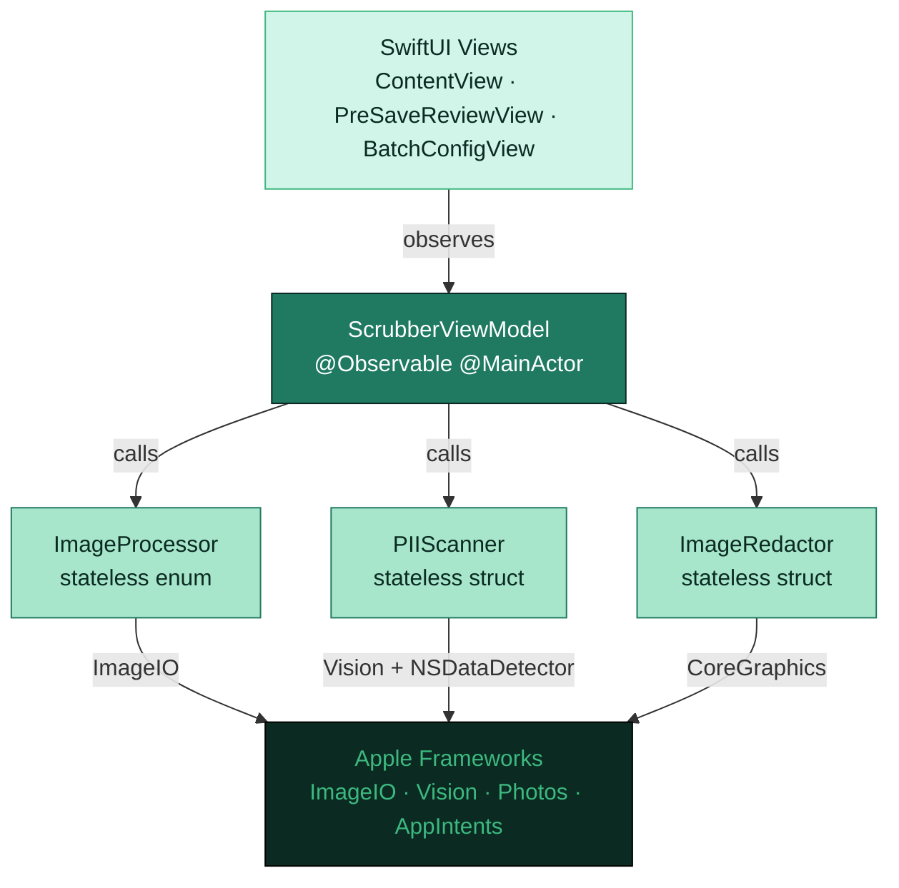
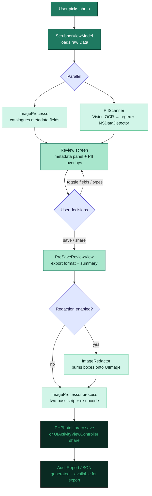
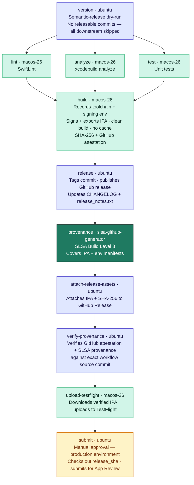

<div align="center">
  

# PicStrip

[](https://www.apple.com/ios/)
[](https://swift.org)
[](https://github.com/northcutted/picstrip/actions)
[](LICENSE)

**Your photos, your privacy. Strip metadata and redact sensitive text — 100% on your device.**

</div>

PicStrip removes EXIF location data, camera metadata, and visually redacts personally identifiable information (PII) from photos before you share them. Every byte of processing happens locally using Apple frameworks. No network calls, no analytics, no third-party code.

---

## Screenshots

<table>
  <tr>
    <td align="center"><br/><sub><b>Home</b></sub></td>
    <td align="center"><br/><sub><b>About</b></sub></td>
    <td align="center"><br/><sub><b>Photo Loaded</b></sub></td>
    <td align="center"><br/><sub><b>Sensitive Data</b></sub></td>
    <td align="center"><br/><sub><b>Review &amp; Save</b></sub></td>
  </tr>
</table>

<table>
  <tr>
    <td align="center"><br/><sub><b>iPad Pro — Photo Loaded</b></sub></td>
    <td align="center"><br/><sub><b>iPad Pro — Sensitive Data</b></sub></td>
  </tr>
</table>

---

## What PicStrip Does

| Feature | Description |
|---------|-------------|
| **Metadata Stripping** | Removes GPS, EXIF, EXIF Auxiliary, TIFF, IPTC, and Apple Maker Note metadata |
| **Visual PII Detection** | On-device OCR scans image content for 20 sensitive data types across 5 categories |
| **Visual PII Redaction** | Burns opaque black boxes over detected regions before export |
| **Batch Processing** | Clean multiple photos at once with a uniform privacy policy |
| **Save or Replace** | Save a new cleaned asset, or replace the original in your Photos library |
| **Flexible Export** | PNG (privacy default), JPEG, HEIC, or match original format |
| **Per-Field Control** | Fine-grained toggles for individual metadata fields and PII types |
| **Audit Reports** | Export a JSON audit of every stripped field and redacted region |
| **Share Extension** | Clean photos directly from the iOS share sheet without opening the app |
| **Siri Shortcuts** | "Clean Photos with PicStrip" intent integrates with Shortcuts and Spotlight |

---

## Why It's Interesting

**Two-pass ImageIO privacy pipeline.**
A single-pass re-encode still triggers iOS to auto-synthesise a minimal EXIF block (ColorSpace, PixelDimensions). PicStrip defeats this with a deliberate two-pass strategy: pass 1 decodes pixels and force-zeros the EXIF/TIFF dictionaries; pass 2 uses `CGImageDestinationCopyImageSource` with `kCGImageDestinationMergeMetadata: false` to replace the entire metadata tree with only what the user explicitly chose to keep. The result is provably clean output, not "mostly clean."

**Orientation-safe OCR.**
PII bounding boxes must land on the right pixels regardless of how the photo was captured. PicStrip passes raw `Data` (not a pre-decoded `CGImage`) to `VNImageRequestHandler` so Vision reads the embedded EXIF orientation tag. Passing a decoded `CGImage` strips that tag, causing highlight boxes to land in the wrong position for any portrait-mode iPhone photo.

**Sequential memory-safe batch processing.**
Each image in a batch is processed, saved, and explicitly deallocated before the next one begins. This keeps peak memory at ~one image at a time rather than accumulating a full batch in RAM, which matters on constrained devices and inside the share extension's 120 MB process ceiling.

**Preview memory discipline.**
PicStrip keeps full-resolution source bytes for export, but decodes bounded ImageIO thumbnails for display and review. Heavy encode/decode work runs off the MainActor, then the view model publishes only final state back to SwiftUI.

**Layered PII detection.**
Three detectors run per OCR observation: a regex rules engine (`DetectionRegistry.allRules`, compiled once at startup) fires first with higher base scores; a reused `NSDataDetector` covers phone numbers, addresses, and links; a cross-observation heuristic catches split credential labels (e.g., a "Password:" label on one line and the value on the next). Each match is scored as `baseScore × ocrConfidence`; the highest score per type wins.

**Zero runtime third-party dependencies.**
Every framework is Apple-native: `ImageIO`, `Vision`, `Photos`, `PhotosUI`, `AppIntents`, `CoreGraphics`, `UIKit`, `SwiftUI`. No package manager dependencies appear in the final binary.

---

## Architecture



### Design pattern: MVVM

| Layer | Type | Notes |
|-------|------|-------|
| `ScrubberViewModel` | `@Observable @MainActor final class` | Owns all mutable state; drives the full data-flow pipeline |
| `ImageProcessor` | `enum` (stateless, static methods) | Two-pass metadata stripping; re-encodes via `ImageIO` |
| `PIIScanner` | `struct` (stateless) | Async; offloads Vision OCR to `Task.detached` |
| `ImageRedactor` | `struct` (stateless) | Burns redaction boxes via `UIGraphicsImageRenderer` |
| `DetectionRegistry` | `enum` (static `let`) | All regex rules compiled once at app startup |

---

## Processing Flow



---

## PII Detection — 20 Types

| Category | Type | Detection method |
|----------|------|-----------------|
| **Contact** | Phone Number | `NSDataDetector` |
| **Contact** | Email Address | Regex (RFC 5322) + `NSDataDetector` |
| **Web** | Link / URL | `NSDataDetector` |
| **Web** | IP Address | Regex |
| **Web** | MAC Address | Regex |
| **Identity** | Address | `NSDataDetector` |
| **Identity** | Social Security Number | Regex (`XXX-XX-XXXX`) |
| **Identity** | Date of Birth | Regex |
| **Identity** | National Insurance Number | Regex |
| **Financial** | Credit Card Number | Regex (Luhn-pattern) |
| **Financial** | IBAN | Regex |
| **Financial** | Crypto Wallet Address | Regex |
| **Developer Secrets** | AWS Access Key | Regex (`AKIA…`) |
| **Developer Secrets** | GitHub Token | Regex (`ghp_…`) |
| **Developer Secrets** | Google API Key | Regex |
| **Developer Secrets** | OpenAI API Key | Regex |
| **Developer Secrets** | Slack Token | Regex (`xox…`) |
| **Developer Secrets** | Stripe Key | Regex |
| **Developer Secrets** | Private Key (generic) | Regex (PEM header) |
| **Unstructured** | Physical Credential / Password | Cross-observation heuristic |

Each match is scored as `baseScore × ocrConfidence`. The result-level score upgrades when a later pass finds a stronger hit for the same type, ensuring the regex pass (higher base scores) always wins over `NSDataDetector` for overlapping types such as email.

---

## Metadata Categories Stripped

| Category | Example fields |
|----------|----------------|
| **GPS** | `GPSLatitude`, `GPSLongitude`, `GPSAltitude`, `GPSTimestamp` |
| **EXIF** | `DateTimeOriginal`, `Make`, `Model`, `LensMake`, `ExposureTime`, `FNumber` |
| **EXIF Auxiliary** | `LensInfo`, `InternalSerialNumber` |
| **TIFF** | `ImageDescription`, `Make`, `Model`, `Software`, `DateTime` |
| **IPTC** | `Keywords`, `Copyright`, `Creator`, `CaptionAbstract` |
| **Apple Maker Note** | Private Apple camera tuning data |

Structural rendering fields (`PixelWidth`, `PixelHeight`, `ColorModel`, `Orientation`, `XResolution`, `YResolution`) are re-synthesised unconditionally by the iOS encoder and are not privacy-sensitive. The UI marks them with a lock icon and explains why they cannot be removed.

---

## Repo Map

```
PicStrip/
├── PicStrip.xcodeproj/
├── README.md
├── DEVELOPMENT.md
├── PRIVACY.md
├── CHANGELOG.md
├── LICENSE
├── .swiftlint.yml
├── .releaserc.json          # semantic-release config
├── Gemfile                  # fastlane + Ruby toolchain
├── package.json             # semantic-release Node toolchain
│
├── .github/workflows/
│   ├── pr.yml               # PR checks: lint, analyze, test
│   ├── main.yml             # Release pipeline: version → build → release → provenance → submit
│   └── screenshots.yml      # Manual: capture App Store screenshots
│
├── fastlane/
│   ├── Fastfile             # Lane definitions
│   ├── Snapfile             # Screenshot configuration
│   ├── screenshots/
│   │   ├── Framefile.json   # force_device_type overrides for 2025 device names
│   │   ├── manifest.json    # Inputs SHA + expected file list (screenshot cache key)
│   │   └── en-US/           # Raw App Store screenshots (committed as cache)
│   └── metadata/            # App Store metadata (title, description, keywords, release notes)
│
├── docs/
│   └── screenshots/         # Framed device-bezel previews (committed; used in this README)
│
├── PicStripCore/            # Shared pure processing/domain code compiled into app + extension
│   ├── ImageProcessor.swift
│   ├── PIIScanner.swift
│   ├── ImageRedactor.swift
│   ├── DetectionModels.swift
│   ├── DetectionRule.swift
│   ├── PIIType.swift
│   └── ExportPreset.swift
│
├── PicStrip/                # Main app target
│   ├── PicStripApp.swift
│   ├── ContentView.swift
│   ├── ScrubberViewModel.swift
│   ├── AuditReport.swift
│   ├── AboutView.swift
│   ├── PreSaveReviewView.swift
│   └── PrivacyInfo.xcprivacy
│
├── PicStripShareExtension/  # Share Extension target (separate binary)
│   ├── ShareViewController.swift   # UIKit host + UIHostingController
│   └── PrivacyInfo.xcprivacy
│
├── PicStripTests/           # Unit tests
│   ├── PIIScannerTests.swift
│   ├── ImageProcessorTests.swift
│   └── DetectionRegistryTests.swift
│
└── PicStripUITests/         # UI / screenshot tests
    └── PicStripUITests.swift        # single testAllScreenshots() method
```

---

## Local Setup

### Run the app

```bash
git clone https://github.com/northcutted/picstrip.git
cd picstrip
open PicStrip.xcodeproj
```

1. Select the **PicStrip** target → **Signing & Capabilities** → change **Team** to your Apple Developer account.
2. Repeat for **PicStripShareExtension**.
3. Select an iPhone 17 simulator (or a physical device running iOS 17+).
4. Press **Cmd + R**.

### Contributor / release tooling

The CI pipeline requires Ruby (Fastlane) and Node (semantic-release).

```bash
# Ruby toolchain (Fastlane)
gem install bundler
bundle install          # installs fastlane ~> 2.233

# Node toolchain (semantic-release)
npm install
```

---

## Developer Commands

| Command | What it does |
|---------|--------------|
| `make help` | Lists local helper commands |
| `make test` | Runs `bundle exec fastlane test` |
| `make build` | Runs `bundle exec fastlane build` |
| `make audit-localization` | Checks shared core/extension string-returning code for literals that should use localization helpers |
| `make localization-export` | Exports Xcode `.xcloc` localization packages to `build/localization-export/` |
| `make localization-translate LANGUAGES="es fr"` | Fills missing string-catalog localizations using the local pseudo provider by default |
| `make localization-translate LOCALIZATION_PROVIDER=openai LANGUAGES="es fr"` | Fills missing string-catalog localizations via OpenAI; requires `OPENAI_API_KEY` |
| `make localization-validate` | Validates string catalog JSON, the localization audit, and SwiftLint |
| `make screenshots` | Runs the full screenshot capture; pass `DEVICE="iPhone 17 Pro Max"` or `DEVICES="iPhone 17 Pro Max,iPhone Air"` for subsets |
| `make upload-screenshots` | Uploads the full local screenshot set; pass `ALLOW_PARTIAL=true` only when intentionally uploading an incomplete set |
| `bundle exec fastlane lint` | SwiftLint strict mode — fails on any warning |
| `bundle exec fastlane analyze` | `xcodebuild analyze` static analysis |
| `bundle exec fastlane test` | `PicStripTests` unit tests on iPhone 17 simulator; outputs JUnit XML to `build/test_output/` |
| `bundle exec fastlane build` | Signs + exports IPA (requires App Store certificates) |
| `bundle exec fastlane beta` | `certificates` → `build` → TestFlight upload |
| `bundle exec fastlane upload_testflight` | Uploads an existing IPA path (`IPA_PATH` or `build/PicStrip.ipa`) to TestFlight |
| `bundle exec fastlane screenshots` | Captures App Store screenshots (reads `fastlane/Snapfile`); pass `device:"iPhone 17 Pro Max"` for a one-device local smoke run |
| `bundle exec fastlane upload_screenshots` | Pushes the full captured screenshot set to App Store Connect; refuses partial sets unless `allow_partial:true` is passed |
| `bundle exec fastlane submit` | Submits the processed TestFlight build for App Review |

---

## Localization Automation

PicStrip uses Apple string catalogs:

- `PicStrip/Localizable.xcstrings`
- `PicStrip/AppShortcuts.xcstrings`

To add a language, run a dry run first:

```bash
scripts/translate_xcstrings.js --languages es fr --dry-run
```

For layout smoke testing without external services, generate pseudo-localized values:

```bash
make localization-translate LANGUAGES="es"
make localization-validate
```

For machine translation, set an OpenAI API key and use the OpenAI provider:

```bash
export OPENAI_API_KEY=...
make localization-translate LOCALIZATION_PROVIDER=openai LANGUAGES="es fr de ja"
make localization-validate
```

The translator preserves placeholders such as `%@`, `%lld`, `${applicationName}`, and Swift inflection markup. Generated translations are written with a review state so privacy, App Shortcut, and permission-copy wording can still be checked before release.

Use Xcode's localization package flow when handing strings to a human translator:

```bash
make localization-export
```

---

## CI/CD Pipeline

### On pull request

`pr.yml` runs three parallel jobs on every PR targeting `main`:

- **Lint** — SwiftLint strict mode; downloads a pinned `portable_swiftlint.zip` and verifies its SHA-256 before use
- **Static Analysis** — `xcodebuild analyze`; caches DerivedData keyed on `project.pbxproj`
- **Unit Tests** — `PicStripTests` on iPhone 17 simulator; JUnit XML uploaded as an artifact (7-day retention)

A fourth job runs only when the `screenshots` label is applied to the PR:

- **PR Screenshots** — boots all three simulators explicitly, overrides status bars to a clean state (9:41, full Wi-Fi/cellular/battery), runs the full 3-device capture, and uploads results as a PR artifact (14-day retention). Snapshot logs are uploaded separately on failure. No upload to App Store Connect from PRs.

### On push to `main`

`main.yml` runs 11 jobs across 9 sequential stages. A semantic-release dry-run in the `version` job gates the entire pipeline — if no releasable commits exist, all downstream jobs are skipped.



### Screenshot workflow

`screenshots.yml` is **manually dispatched** (not part of the release pipeline). It captures App Store screenshots on iPhone 17 Pro Max, iPhone Air, and iPad Pro 13-inch (M5), leaving simulator boot and status bar handling to Fastlane/Xcode. All screenshots land in one `testAllScreenshots()` method to avoid XCTest's terminate-and-relaunch behavior between separate test methods, which fails reliably in headless CI.

**Cache behaviour:** on each run the workflow computes a SHA-256 hash of all inputs that affect screenshot appearance (`PicStrip/`, `PicStripUITests/PicStripUITests.swift`, `PicStripUITests/test_list.png`, `fastlane/Snapfile`). If the hash matches `fastlane/screenshots/manifest.json` and all 15 expected PNGs are present in the repo, the simulator is skipped entirely and the existing screenshots are uploaded directly. On a cache miss the workflow recaptures, frames, updates `manifest.json`, and commits the new cache back to `main` with `[skip ci]`.

---

## Privacy

### 100% on-device

- No internet required
- No analytics or tracking
- No data collection
- No remote servers

Every step runs locally: `UIImage(data:)` decoding, `ImageIO` metadata extraction and re-encoding, Vision OCR, `NSRegularExpression` matching, `CoreGraphics` redaction rendering. Network Inspector in Xcode will show zero outbound connections.

### Privacy manifest

Both the main app and the share extension declare zero data collection and zero tracking domains in `PrivacyInfo.xcprivacy`. The only required-reason API used is `NSPrivacyAccessedAPICategoryFileTimestamp` (`C617.1`) for ImageIO file timestamp access during metadata extraction — not for fingerprinting.

### Permissions

| Permission | When |
|-----------|------|
| `NSPhotoLibraryAddUsageDescription` (add-only) | Saving a new cleaned asset |
| `NSPhotoLibraryUsageDescription` (read + write) | "Replace Original" — needs read access to delete the source |

---

## Supply Chain Security (SLSA Level 3)

Every release is accompanied by SLSA Build Level 3 provenance for the GitHub-built `PicStrip.ipa`, cryptographically proving the IPA was built by GitHub Actions — not a developer's machine — with no post-build tampering.

- Verifiable proof of origin: built by GitHub Actions infrastructure
- Immutable audit trail: every build is logged and timestamped
- Tamper detection: SHA-256 checksum cryptographically binds the attestation to the IPA
- GitHub-native attestations: `actions/attest-build-provenance` uploads provenance to the repository Attestations API for the IPA
- Distribution gate: TestFlight upload happens only after GitHub and SLSA provenance verification pass
- Transparent: all build logs and provenance are publicly auditable

This claim applies to the GitHub-built IPA attached to the release. It does not claim that the same digest identifies the App Store-installed app, because Apple may re-sign, encrypt, thin, or otherwise transform the distributed binary.

**Verify an IPA with GitHub artifact attestations:**

```bash
gh attestation verify PicStrip.ipa \
  --repo northcutted/picstrip \
  --signer-workflow github.com/northcutted/picstrip/.github/workflows/main.yml \
  --source-ref refs/heads/main \
  --source-digest <release-workflow-source-commit>
```

**Verify the release-attached SLSA provenance:**

```bash
slsa-verifier verify-artifact PicStrip.ipa \
  --provenance-path PicStrip.ipa.intoto.jsonl \
  --source-uri github.com/northcutted/picstrip \
  --source-branch main
```

The source commit is verified from provenance, not inferred from the release tag.

See [DEVELOPMENT.md](DEVELOPMENT.md#slsa-build-provenance-level-3) for detailed verification steps.

---

## App Store

PicStrip is available on the App Store.

[](https://apps.apple.com/app/picstrip/idTODO_REPLACE_WITH_REAL_ID)

> Replace `TODO_REPLACE_WITH_REAL_ID` with the actual App Store ID once published.

---

## Requirements

| | |
|-|-|
| **iOS** | 17.0+ |
| **Xcode** | 16.0+ (Xcode 26 on CI) |
| **Swift** | 5.9+ |
| **macOS** | 14.0+ (for development) |
| **Apple Developer Account** | Required for signing and share extension entitlements |

---

## Contributing

See [DEVELOPMENT.md](DEVELOPMENT.md) for architecture details, data-flow diagrams, the PII detection deep-dive, and step-by-step instructions for adding a new PII type.

Commits follow [Conventional Commits](https://www.conventionalcommits.org/):
- `feat:` — minor version bump
- `fix:` / `perf:` / `revert:` — patch bump
- `BREAKING CHANGE:` — major bump

---

## License

MIT. See [LICENSE](LICENSE).

---

## Support

- Open an [Issue](https://github.com/northcutted/picstrip/issues)
- Start a [Discussion](https://github.com/northcutted/picstrip/discussions)
