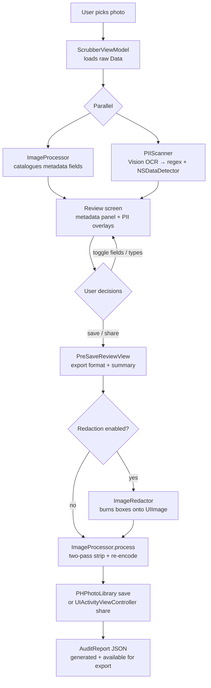

# PicStrip

[](https://www.apple.com/ios/)
[](https://swift.org)
[](https://github.com/northcutted/picstrip/actions)
[](LICENSE)

**Your photos, your privacy. Strip metadata and redact sensitive text — 100% on your device.**

PicStrip removes EXIF location data, camera metadata, and visually redacts personally identifiable information (PII) from photos before you share them. Every byte of processing happens locally using Apple frameworks. No network calls, no analytics, no third-party code.

---

## Screenshots

> **[Screenshot 1: Home Screen]**
>
> Animated gradient background with "PicStrip" title and rotating tagline carousel. Lifetime stats capsule shows total photos cleaned and metadata fields stripped.

> **[Screenshot 2: Photo with Metadata & PII]**
>
> Full-screen image with red bounding boxes highlighting detected PII regions. Bottom panel shows categorized metadata (GPS, EXIF, TIFF, IPTC, etc.) ready for stripping.

> **[Screenshot 3: Redaction Preview]**
>
> Same photo with opaque black redaction boxes burned over sensitive regions. Per-field and per-category toggles visible in the sliding detail panel.

---

## What PicStrip Does

| Feature | Description |
|---------|-------------|
| **Metadata Stripping** | Removes GPS, EXIF, EXIF Auxiliary, TIFF, IPTC, and Apple Maker Note metadata |
| **Visual PII Detection** | On-device OCR scans image content for 20 sensitive data types across 5 categories |
| **Visual PII Redaction** | Burns opaque black boxes over detected regions before export |
| **Batch Processing** | Clean multiple photos at once with a uniform privacy policy |
| **Save or Replace** | Save a new cleaned asset, or replace the original in your Photos library |
| **Flexible Export** | PNG (privacy default), JPEG, HEIC, or match original format |
| **Per-Field Control** | Fine-grained toggles for individual metadata fields and PII types |
| **Audit Reports** | Export a JSON audit of every stripped field and redacted region |
| **Share Extension** | Clean photos directly from the iOS share sheet without opening the app |
| **Siri Shortcuts** | "Clean Photos with PicStrip" intent integrates with Shortcuts and Spotlight |

---

## Why It's Interesting

**Two-pass ImageIO privacy pipeline.**
A single-pass re-encode still triggers iOS to auto-synthesise a minimal EXIF block (ColorSpace, PixelDimensions). PicStrip defeats this with a deliberate two-pass strategy: pass 1 decodes pixels and force-zeros the EXIF/TIFF dictionaries; pass 2 uses `CGImageDestinationCopyImageSource` with `kCGImageDestinationMergeMetadata: false` to replace the entire metadata tree with only what the user explicitly chose to keep. The result is provably clean output, not "mostly clean."

**Orientation-safe OCR.**
PII bounding boxes must land on the right pixels regardless of how the photo was captured. PicStrip passes raw `Data` (not a pre-decoded `CGImage`) to `VNImageRequestHandler` so Vision reads the embedded EXIF orientation tag. Passing a decoded `CGImage` strips that tag, causing highlight boxes to land in the wrong position for any portrait-mode iPhone photo.

**Sequential memory-safe batch processing.**
Each image in a batch is processed, saved, and explicitly deallocated before the next one begins. This keeps peak memory at ~one image at a time rather than accumulating a full batch in RAM, which matters on constrained devices and inside the share extension's 120 MB process ceiling.

**Layered PII detection.**
Three detectors run per OCR observation: a regex rules engine (`DetectionRegistry.allRules`, compiled once at startup) fires first with higher base scores; `NSDataDetector` covers phone numbers, addresses, and links; a cross-observation heuristic catches split credential labels (e.g., a "Password:" label on one line and the value on the next). Each match is scored as `baseScore × ocrConfidence`; the highest score per type wins.

**Zero runtime third-party dependencies.**
Every framework is Apple-native: `ImageIO`, `Vision`, `Photos`, `PhotosUI`, `AppIntents`, `CoreGraphics`, `UIKit`, `SwiftUI`. No package manager dependencies appear in the final binary.

---

## Architecture

```mermaid
graph TD
    A[SwiftUI Views<br/>ContentView · PreSaveReviewView · BatchConfigView] -->|observes| B[ScrubberViewModel<br/>@Observable @MainActor]
    B -->|calls| C[ImageProcessor<br/>stateless enum]
    B -->|calls| D[PIIScanner<br/>stateless struct]
    B -->|calls| E[ImageRedactor<br/>stateless struct]
    C -->|ImageIO| F[Apple Frameworks<br/>ImageIO · Vision · Photos · AppIntents]
    D -->|Vision + NSDataDetector| F
    E -->|CoreGraphics| F
```

### Design pattern: MVVM

| Layer | Type | Notes |
|-------|------|-------|
| `ScrubberViewModel` | `@Observable @MainActor final class` | Owns all mutable state; drives the full data-flow pipeline |
| `ImageProcessor` | `enum` (stateless, static methods) | Two-pass metadata stripping; re-encodes via `ImageIO` |
| `PIIScanner` | `struct` (stateless) | Async; offloads Vision OCR to `Task.detached` |
| `ImageRedactor` | `struct` (stateless) | Burns redaction boxes via `UIGraphicsImageRenderer` |
| `DetectionRegistry` | `enum` (static `let`) | All regex rules compiled once at app startup |

---

## Processing Flow



---

## PII Detection — 20 Types

| Category | Type | Detection method |
|----------|------|-----------------|
| **Contact** | Phone Number | `NSDataDetector` |
| **Contact** | Email Address | Regex (RFC 5322) + `NSDataDetector` |
| **Web** | Link / URL | `NSDataDetector` |
| **Web** | IP Address | Regex |
| **Web** | MAC Address | Regex |
| **Identity** | Address | `NSDataDetector` |
| **Identity** | Social Security Number | Regex (`XXX-XX-XXXX`) |
| **Identity** | Date of Birth | Regex |
| **Identity** | National Insurance Number | Regex |
| **Financial** | Credit Card Number | Regex (Luhn-pattern) |
| **Financial** | IBAN | Regex |
| **Financial** | Crypto Wallet Address | Regex |
| **Developer Secrets** | AWS Access Key | Regex (`AKIA…`) |
| **Developer Secrets** | GitHub Token | Regex (`ghp_…`) |
| **Developer Secrets** | Google API Key | Regex |
| **Developer Secrets** | OpenAI API Key | Regex |
| **Developer Secrets** | Slack Token | Regex (`xox…`) |
| **Developer Secrets** | Stripe Key | Regex |
| **Developer Secrets** | Private Key (generic) | Regex (PEM header) |
| **Unstructured** | Physical Credential / Password | Cross-observation heuristic |

Each match is scored as `baseScore × ocrConfidence`. The result-level score upgrades when a later pass finds a stronger hit for the same type, ensuring the regex pass (higher base scores) always wins over `NSDataDetector` for overlapping types such as email.

---

## Metadata Categories Stripped

| Category | Example fields |
|----------|----------------|
| **GPS** | `GPSLatitude`, `GPSLongitude`, `GPSAltitude`, `GPSTimestamp` |
| **EXIF** | `DateTimeOriginal`, `Make`, `Model`, `LensMake`, `ExposureTime`, `FNumber` |
| **EXIF Auxiliary** | `LensInfo`, `InternalSerialNumber` |
| **TIFF** | `ImageDescription`, `Make`, `Model`, `Software`, `DateTime` |
| **IPTC** | `Keywords`, `Copyright`, `Creator`, `CaptionAbstract` |
| **Apple Maker Note** | Private Apple camera tuning data |

Structural rendering fields (`PixelWidth`, `PixelHeight`, `ColorModel`, `Orientation`, `XResolution`, `YResolution`) are re-synthesised unconditionally by the iOS encoder and are not privacy-sensitive. The UI marks them with a lock icon and explains why they cannot be removed.

---

## Repo Map

```
PicStrip/
├── PicStrip.xcodeproj/
├── README.md
├── DEVELOPMENT.md
├── PRIVACY.md
├── CHANGELOG.md
├── LICENSE
├── .swiftlint.yml
├── .releaserc.json          # semantic-release config
├── Gemfile                  # fastlane + Ruby toolchain
├── package.json             # semantic-release Node toolchain
│
├── .github/workflows/
│   ├── pr.yml               # PR checks: lint, analyze, test
│   ├── main.yml             # Release pipeline: version → build → release → provenance → submit
│   └── screenshots.yml      # Manual: capture App Store screenshots
│
├── fastlane/
│   ├── Fastfile             # Lane definitions
│   ├── Snapfile             # Screenshot configuration
│   └── metadata/            # App Store metadata (title, description, keywords, release notes)
│
├── PicStrip/                # Main app target
│   ├── PicStripApp.swift
│   ├── ContentView.swift
│   ├── ScrubberViewModel.swift
│   ├── ImageProcessor.swift
│   ├── PIIScanner.swift
│   ├── ImageRedactor.swift
│   ├── DetectionRegistry.swift
│   ├── DetectionRule.swift
│   ├── PIIType.swift
│   ├── AuditReport.swift
│   ├── ExportPreset.swift
│   ├── AboutView.swift
│   ├── PreSaveReviewView.swift
│   └── PrivacyInfo.xcprivacy
│
├── PicStripShareExtension/  # Share Extension target (separate binary)
│   ├── ShareViewController.swift   # UIKit host + UIHostingController
│   ├── ExtensionViewModel.swift
│   ├── ImageProcessor.swift        # duplicate — extensions cannot link to main app
│   └── PrivacyInfo.xcprivacy
│
├── PicStripTests/           # Unit tests
│   ├── PIIScannerTests.swift
│   ├── ImageProcessorTests.swift
│   └── DetectionRegistryTests.swift
│
└── PicStripUITests/         # UI / screenshot tests
    └── PicStripUITests.swift        # single testAllScreenshots() method
```

---

## Local Setup

### Run the app

```bash
git clone https://github.com/northcutted/picstrip.git
cd picstrip
open PicStrip.xcodeproj
```

1. Select the **PicStrip** target → **Signing & Capabilities** → change **Team** to your Apple Developer account.
2. Repeat for **PicStripShareExtension**.
3. Select an iPhone 17 simulator (or a physical device running iOS 17+).
4. Press **Cmd + R**.

### Contributor / release tooling

The CI pipeline requires Ruby (Fastlane) and Node (semantic-release).

```bash
# Ruby toolchain (Fastlane)
gem install bundler
bundle install          # installs fastlane ~> 2.233

# Node toolchain (semantic-release)
npm install
```

---

## Developer Commands

| Command | What it does |
|---------|--------------|
| `bundle exec fastlane lint` | SwiftLint strict mode — fails on any warning |
| `bundle exec fastlane analyze` | `xcodebuild analyze` static analysis |
| `bundle exec fastlane test` | Unit tests on iPhone 17 simulator; outputs JUnit XML to `build/test_output/` |
| `bundle exec fastlane build` | Signs + exports IPA (requires App Store certificates) |
| `bundle exec fastlane beta` | `certificates` → `build` → TestFlight upload |
| `bundle exec fastlane screenshots` | Captures App Store screenshots (reads `fastlane/Snapfile`) |
| `bundle exec fastlane upload_screenshots` | Pushes captured screenshots to App Store Connect |
| `bundle exec fastlane submit` | Submits the processed TestFlight build for App Review |

---

## CI/CD Pipeline

### On pull request

`pr.yml` runs three parallel jobs on every PR targeting `main`:

- **Lint** — SwiftLint strict mode
- **Static Analysis** — `xcodebuild analyze`
- **Unit Tests** — full suite on iPhone 17 simulator; JUnit XML uploaded as an artifact

### On push to `main`

`main.yml` runs seven sequential jobs. A semantic-release dry-run in the `version` job gates the entire pipeline — if no releasable commits exist, all downstream jobs are skipped.

```
version (ubuntu) ──► lint / analyze / test (macos-26, parallel)
                          │
                          ▼
                     build (macos-26)
                    Signs + exports IPA; uploads to TestFlight; computes SHA-256
                          │
                          ▼
                     release (ubuntu)
                    semantic-release: tags commit, publishes GitHub release, updates CHANGELOG
                          │
                     ┌────┴────┐
                     ▼         ▼
                provenance   submit
                SLSA L3      Requires manual approval via the "production"
                attestation  GitHub environment; submits for App Review
```

### Screenshot workflow

`screenshots.yml` is **manually dispatched** (not part of the release pipeline). It boots three simulators (iPhone 16 Pro Max, iPhone 16 Plus, iPhone SE 3rd generation), overrides the status bar, runs a single `testAllScreenshots()` test method, and uploads results as artifacts. All screenshots land in one `testAllScreenshots()` method to avoid XCTest's terminate-and-relaunch behavior between separate test methods, which fails reliably in headless CI.

---

## Privacy

### 100% on-device

- No internet required
- No analytics or tracking
- No data collection
- No remote servers

Every step runs locally: `UIImage(data:)` decoding, `ImageIO` metadata extraction and re-encoding, Vision OCR, `NSRegularExpression` matching, `CoreGraphics` redaction rendering. Network Inspector in Xcode will show zero outbound connections.

### Privacy manifest

Both the main app and the share extension declare zero data collection and zero tracking domains in `PrivacyInfo.xcprivacy`. The only required-reason API used is `NSPrivacyAccessedAPICategoryFileTimestamp` (`C617.1`) for ImageIO file timestamp access during metadata extraction — not for fingerprinting.

### Permissions

| Permission | When |
|-----------|------|
| `NSPhotoLibraryAddUsageDescription` (add-only) | Saving a new cleaned asset |
| `NSPhotoLibraryUsageDescription` (read + write) | "Replace Original" — needs read access to delete the source |

---

## Supply Chain Security (SLSA Level 3)

Every release is accompanied by a SLSA Level 3 provenance attestation, cryptographically proving the binary was built by GitHub Actions — not a developer's machine — with no post-build tampering.

- Verifiable proof of origin: built by GitHub Actions infrastructure
- Immutable audit trail: every build is logged and timestamped
- Tamper detection: SHA-256 checksum cryptographically binds the attestation to the IPA
- Transparent: all build logs are publicly auditable

**Verify an IPA:**

```bash
slsa-verifier verify-artifact PicStrip.ipa \
  --provenance-path PicStrip.ipa.attestation \
  --source-uri github.com/northcutted/picstrip
```

See [DEVELOPMENT.md](DEVELOPMENT.md#slsa-provenance-level-3) for detailed verification steps.

---

## App Store

PicStrip is available on the App Store.

[](https://apps.apple.com/app/picstrip/idTODO_REPLACE_WITH_REAL_ID)

> Replace `TODO_REPLACE_WITH_REAL_ID` with the actual App Store ID once published.

---

## Requirements

| | |
|-|-|
| **iOS** | 17.0+ |
| **Xcode** | 16.0+ (Xcode 26 on CI) |
| **Swift** | 5.9+ |
| **macOS** | 14.0+ (for development) |
| **Apple Developer Account** | Required for signing and share extension entitlements |

---

## Contributing

See [DEVELOPMENT.md](DEVELOPMENT.md) for architecture details, data-flow diagrams, the PII detection deep-dive, and step-by-step instructions for adding a new PII type.

Commits follow [Conventional Commits](https://www.conventionalcommits.org/):
- `feat:` — minor version bump
- `fix:` / `perf:` / `revert:` — patch bump
- `BREAKING CHANGE:` — major bump

---

## License

MIT. See [LICENSE](LICENSE).

---

## Support

- Open an [Issue](https://github.com/northcutted/picstrip/issues)
- Start a [Discussion](https://github.com/northcutted/picstrip/discussions)
