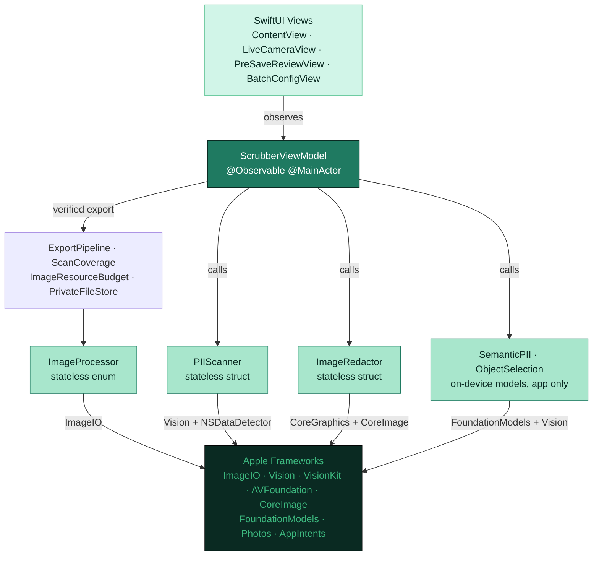

<div align="center">
  

# PicStrip

[](https://www.apple.com/ios/)
[](https://swift.org)
[](https://github.com/northcutted/picstrip/actions)
[](LICENSE)

**Your photos, your privacy. Strip metadata and redact sensitive text — 100% on your device.**

</div>

PicStrip removes EXIF location data, camera metadata, and visually redacts personally identifiable information (PII) from photos and videos before you share them. Scanning and image processing use Apple frameworks on the device. PicStrip has no developer photo server, analytics or advertising SDK. User-selected imports, saves and shares follow the chosen service settings; optional Apple models may need a download.

---

## Screenshots

<p align="center">
  
  
  
</p>

---

## What PicStrip Does

| Feature | Description |
|---------|-------------|
| **Metadata Stripping** | Removes GPS, EXIF, EXIF Auxiliary, TIFF, IPTC, and Apple Maker Note metadata, with per-field control over what to keep |
| **Visual PII Detection** | On-device OCR and Vision find 31 kinds of sensitive data across 4 risk tiers (Critical, High, Medium, Low) |
| **Name Detection** | Where Apple Intelligence is on, Apple's on-device language model finds people's names — listed, off by default, never Private Cloud Compute |
| **Redaction Editor** | Solid, crosshatch, pixelate, blur in 12 colors, or an emoji (each face its own, on a strong blur), with adjustable blur and pixelate strength, previewed live in the editor; move, resize, draw your own boxes; multi-select bulk edits; 50-step undo/redo |
| **Tap to Redact** | On iOS 27, tap an object and PicStrip boxes it for you (uses an Apple model that iOS downloads once, only after you agree) |
| **Camera** | The main action: one camera with Photo, Video and Document modes, each with the Camera app's lens buttons, pinch to zoom, tap to focus and drag for exposure, the front camera and the Camera Control's sliders where they apply. Photo: an advisory live viewfinder that outlines and names what it would redact, with its match strength, and can preview the result; the captured image receives a full scan and review, and the original never reaches your photo library. Video: records at the Camera app's quality straight into the video cleaner (see Videos). Document: Apple's document scanner |
| **Partial Covering** | Leave the last four digits of a card, phone or ID number — or an email's domain — readable, per finding |
| **Always Cover** | Words and phrases (your name, a plate, your street) covered wherever PicStrip reads them: editor, batches and live camera; kept in one protected, non-backed-up file on the device |
| **Sharing Presets** | Everyday photo, screenshot or document, recognised on import: picks JPEG or PNG and what is covered straight away |
| **Before and After** | Hold the review preview to see the original; a summary and a confirmation after saving say what was removed |
| **Photos & Videos** | One library button: one photo opens the editor, one video the video cleaner, and several photos, several videos, or both at once go to one batch. Screenshots are a collection in the picker, and a "Clean a Screenshot" shortcut opens it at your screenshots, without library access |
| **Videos and Live Photos** | Record a video with PicStrip's camera — 4K or HD, 24 to 120 fps, HDR, enhanced stabilization, every lens, the flashlight and the Camera Control — or pick one; find the faces, sensitive text, codes and Always Cover words in a video and cover them — faces with a strong blur or an emoji per face, text with a solid box, mosaic or blur — choosing what stays visible; cover any object by drawing around it — PicStrip tracks it through the video; select a stretch of sound on the timeline to bleep or mute it; a video-editor timeline, which zooms, shows every cover and sound edit as a clip you can trim; preview before saving; remove a video's location, device and dates (without re-encoding when no face is covered); keep a Live Photo's motion when nothing is covered |
| **Import Anywhere** | Photos, Files (images and videos), paste, drag and drop; review the supplied image and metadata |
| **Batch Processing** | Photos and videos, sequentially, with a shared policy; in videos every face found is blurred and text covered, with no review; incomplete visual scans are skipped, successful copies are retained, and cancellation stops future saves; multi-page document scans use it too |
| **Try a Sample** | Explore a fictional image without granting library access; compare the original and cleaned output |
| **Accessible Editing** | Add a centered box and adjust its position and size without drawing; changes remain undoable |
| **Save, Replace, Share** | Save a cleaned copy, replace the original, or share; PNG for screenshots and documents, JPEG for everyday photos (both chosen by the sharing preset), HEIC, or the original format |
| **Audit Reports** | Export field names, counts and scan status without original values or detected text |
| **Share Extension** | Save cleaned copies of photos and videos from the share sheet (videos have their metadata removed there; covering faces and text in a video happens in the app), or prepare the first original photo or video for editing using a protected, expiring handoff |
| **Shortcuts** | "Clean Photos with PicStrip" opens the picker, "Take a Photo" opens the camera and "Clean a Screenshot" opens your screenshots — all usable from the Action Button or a Control Center shortcut; "Strip Metadata from Images" and "Strip Metadata from Videos" remove metadata only, in the background, and return the cleaned files |

Available in English and 16 more localizations, including separate Spanish for Spain and Latin America.

---

## Privacy

- Scanning, redaction and metadata removal happen on your device. No account, analytics or advertising SDK is required.
- Name suggestions use Apple's on-device model and remain optional for redaction.
- Live-camera overlays are a guide; review the full scan after capture. PicStrip does not automatically save an unreviewed capture to Photos.
- A model for object selection can download from Apple after consent. Cloud imports, synced photo libraries and chosen share destinations follow their own settings.
- Protected, backup-excluded edit handoffs expire after 15 minutes and are consumed once. Export files are cleaned up on completion where possible, with an expiry sweep as a fallback.
- Automatic detection can miss details. Failed required checks remain visible and require a deliberate manual-review confirmation in the editor; unattended visual workflows reject incomplete scans.

The full statement is in [PRIVACY.md](PRIVACY.md); the privacy manifest, permissions and required-reason APIs are covered in [DEVELOPMENT.md](docs/development/architecture.md#privacy--security).

---

## How It Works


```mermaid
graph TD
    A["SwiftUI Views\nContentView · LiveCameraView · PreSaveReviewView · BatchConfigView"] -->|observes| B["ScrubberViewModel\n@Observable @MainActor"]
    B -->|verified export| P["ExportPipeline · ScanCoverage\nImageResourceBudget · PrivateFileStore"]
    P --> C["ImageProcessor\nstateless enum"]
    B -->|calls| D["PIIScanner\nstateless struct"]
    B -->|calls| E["ImageRedactor\nstateless struct"]
    B -->|calls| G["SemanticPII · ObjectSelection\non-device models, app only"]
    C -->|ImageIO| F["Apple Frameworks\nImageIO · Vision · VisionKit · AVFoundation · CoreImage\nFoundationModels · Photos · AppIntents"]
    D -->|Vision + NSDataDetector| F
    E -->|CoreGraphics + CoreImage| F
    G -->|FoundationModels + Vision| F

    classDef views   fill:#d1f5e8,stroke:#3db87f,color:#0a2a22
    classDef vm      fill:#1f7a61,stroke:#0a2a22,color:#ffffff
    classDef service fill:#a8e6cc,stroke:#1f7a61,color:#0a2a22
    classDef system  fill:#0a2a22,stroke:#000000,color:#3db87f

    class A views
    class B vm
    class C,D,E,G service
    class F system
```

**A two-pass ImageIO pipeline.** A single re-encode still lets iOS synthesise a minimal EXIF block. PicStrip decodes and zeroes the EXIF/TIFF dictionaries, then uses `CGImageDestinationCopyImageSource` with `kCGImageDestinationMergeMetadata: false` to replace the whole metadata tree with only what you chose to keep.

**Layered detection.** One `ImageRequestHandler(data).performAll(...)` pass runs text, face, barcode and document-rectangle requests; 60 regex rules, `NSDataDetector` and a cross-line credential heuristic work over the recognised text; checksums adjust confidence; document context boosts what belongs on a card or ID. Raw `Data` — not a decoded image — goes to Vision, so boxes land correctly whatever the photo's orientation.

**Zero runtime third-party dependencies.** Every framework is Apple's. Details, data flows and the full detection catalog are in [DEVELOPMENT.md](DEVELOPMENT.md).

---

## Run It

```bash
git clone https://github.com/northcutted/picstrip.git
cd picstrip
open PicStrip.xcodeproj
```

1. Select the **PicStrip** target → **Signing & Capabilities** → set **Team** to your Apple Developer account. Repeat for **PicStripShareExtension**.
2. Pick an iPhone 17 simulator, or a device running iOS 26 or later. The camera, document scanner and tap to redact need a real device.
3. Press **Cmd + R**.

| | |
|-|-|
| **iOS** | 26.0+ (tap to redact needs iOS 27; name detection needs Apple Intelligence) |
| **Xcode** | 27.0 (26.6 is the pinned compatibility build; iOS 27-only code compiles out below Swift 6.4) |
| **Swift** | Swift 6 language mode |
| **Apple Developer Account** | Required for signing and the share extension's App Group |

---

## Developer Commands

| Command | What it does |
|---------|--------------|
| `make help` | Lists every helper command |
| `make test` | Unit tests on the iPhone 17 simulator |
| `make lint` | SwiftLint (strict) plus the string catalog audit |
| `make audit-localization` | Finds unlocalized literals and catalog gaps (every key in all 16 localizations, placeholders intact, plural forms complete) |
| `make screenshots` | App Store screenshot capture; `DEVICE=` / `DEVICES=` select a subset |

For checks, TestFlight, and App Store updates, start with [CI/CD: from a change to the App Store](docs/release-pipeline.md). The [workflow reference](docs/ci-cd/reference.md) is generated from source; `make docs` refreshes it and `make check-docs` catches drift. The pinned release platform targets SLSA Build Level 3 for the GitHub-built IPA.

Translations are LLM-generated from the English source and edited inline; the rules and per-locale terms are in the [localization guide](docs/development/localization.md#localization) and the [localization glossary](docs/localization-glossary.md).

---

## Contributing

See [DEVELOPMENT.md](DEVELOPMENT.md) for the architecture, data flows, the detection engine, and how to add a new PII type.

Commits follow [Conventional Commits](https://www.conventionalcommits.org/): `feat:` bumps the minor version, `fix:` / `perf:` / `revert:` the patch, `BREAKING CHANGE:` the major.

---

## App Store

[](https://apps.apple.com/app/picstrip/id6765989071)

---

## License and Support

MIT — see [LICENSE](LICENSE). Questions and bugs: open an [Issue](https://github.com/northcutted/picstrip/issues) or start a [Discussion](https://github.com/northcutted/picstrip/discussions).
