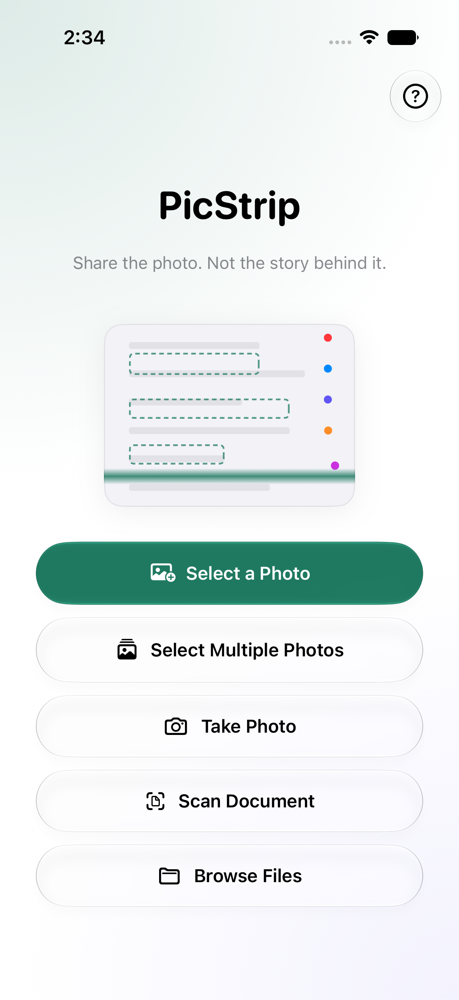
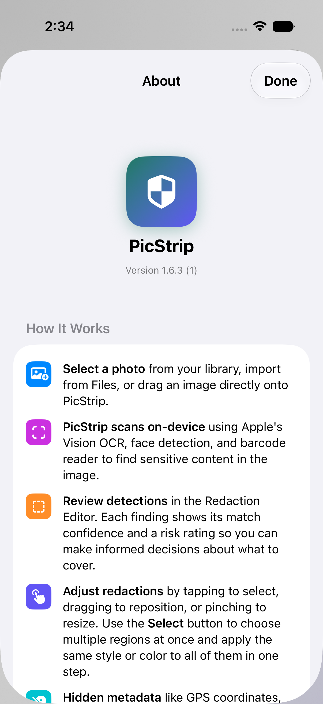
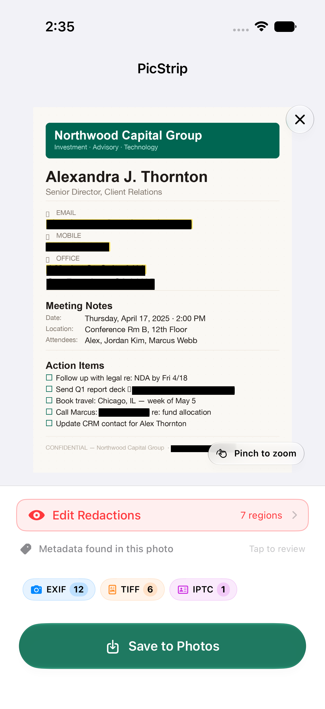
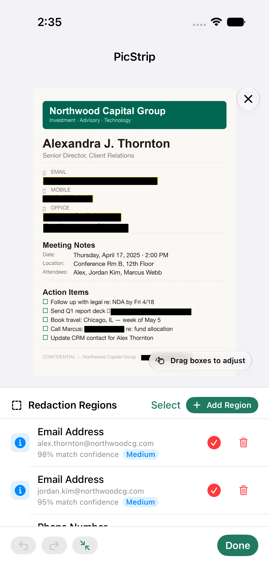
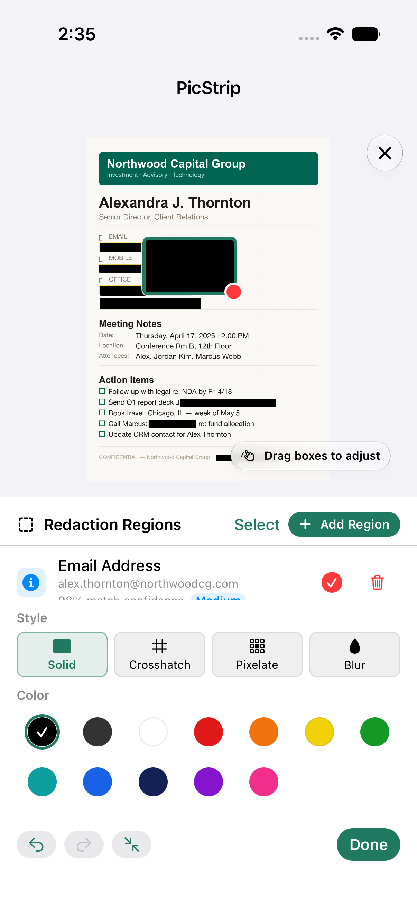
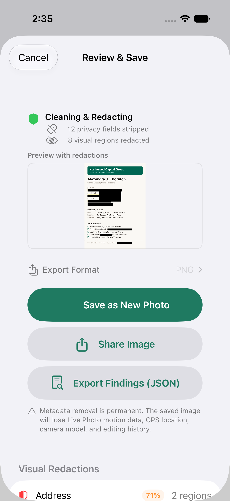

**PicStrip release review — 27 September 2026**

**Recommendation: hold submission of the staged 1.7.0 build.** PicStrip has a credible foundation for private, on-device photo cleaning, and the current editor offers useful control. The staged binary predates a known Photos-save crash fix. Current source also has three confirmed gaps in the final privacy/sharing workflow, plus store-copy discrepancies that should be corrected before packaging its replacement.

This review covers current source at c7eabd3b4b24f35059bc0df56b9ae455b49caf4f, fresh simulator interaction, targeted diagnostic tests, packaged release evidence, and the latest available Apple status observation. Application source, Apple records, published releases, and workflow configuration were not changed. Diagnostic tests are preserved as text outside the build targets.

**What is actually staged**

| Item | Version/build | Evidence and consequence |
|---|---|---|
| Apple version record | 1.7.0 / 77.1 | PREPARE_FOR_SUBMISSION; build VALID and App Store eligible. Observed 27 September at 14:24:52 CDT. Present in App Store Connect, but this version is not yet submitted or released according to that observation. |
| Published immutable release | v1.7.0 / 77.1 | Source c042d27c17cb359c815dc0744f312c6edc00d2df. It predates the 20 September Photos-save fix. |
| Latest prepared candidate | 1.8.0 / 85.1 | Source c7eabd3b4b24f35059bc0df56b9ae455b49caf4f, matching the reviewed checkout. Prepared successfully; do not mistake it for the staged 1.7.0 binary. |
| Local review build | Current source, Debug | Local About screen displays project defaults 1.6.3 (1). These screenshots are review evidence, not submission-ready screenshots or proof of release version stamping. |

Sources: [Apple observation workflow](https://github.com/northcutted/picstrip/actions/runs/36344183439), [saved Apple observation](../evidence/release-review-2026-09-27/app-store-observation.json), [immutable v1.7.0 release](https://github.com/northcutted/picstrip/releases/tag/v1.7.0), [latest preparation workflow](https://github.com/northcutted/picstrip/actions/runs/35539347082), and [latest candidate manifest](../evidence/release-review-2026-09-27/latest-release-build-manifest.json). This is a timestamped workflow observation, not a direct live App Store Connect session or verification of the public storefront.

**Fix before release**

P1 means a release-blocking problem for this app's central promise. P2 means a narrower defect or a gap that needs resolution or explicit acceptance.

| Priority | Finding | Evidence | Required outcome |
|---|---|---|---|
| P1 — staged binary | Build 77.1 contains the known Photos-save crash path. | The tagged source calls PhotoKit change blocks from the MainActor view model. [The subsequent fix](https://github.com/northcutted/picstrip/commit/cec10f186be2af75807aefbac7a2b0126898a865) moves single, replace, batch, and extension writes into a nonisolated helper. Current source passes a real Photos-save UI test. | Submit a newly built, verified binary containing the fix. Changing metadata cannot repair 77.1. |
| P1 — current source | Failed or incomplete scanning can reach export without a lasting warning. | [ScrubberViewModel.swift:708](https://github.com/northcutted/picstrip/blob/c7eabd3b4b24f35059bc0df56b9ae455b49caf4f/PicStrip/ScrubberViewModel.swift#L708) records an OCR error; [line 1176](https://github.com/northcutted/picstrip/blob/c7eabd3b4b24f35059bc0df56b9ae455b49caf4f/PicStrip/ScrubberViewModel.swift#L1176) clears it during export preparation. A focused test reproduced the loss. [PIIScanner.swift:199](https://github.com/northcutted/picstrip/blob/c7eabd3b4b24f35059bc0df56b9ae455b49caf4f/PicStripCore/PIIScanner.swift#L199) also absorbs individual request errors; failed face fallback and barcode scanning can become empty results. | Carry typed scan status through review and export, separately for text, faces, barcodes, and optional features. Incomplete checks must stay visible. Automated paths should skip failures; an interactive manual-review override must be explicit. |
| P1 — current source | The shareable JSON report includes the private values removed from the image. | [ScrubberViewModel.swift:1377](https://github.com/northcutted/picstrip/blob/c7eabd3b4b24f35059bc0df56b9ae455b49caf4f/PicStrip/ScrubberViewModel.swift#L1377) copies original metadata values into the report; batch reporting follows the same approach. A fixture's removed latitude and longitude both appeared in JSON. | Default reports should contain counts, field names, and verified output status. Omit sensitive values. If raw diagnostics remain, require a clearly explained choice and protect/clean up their temporary files. |
| P1 — core sharing | “Share Image” exports generic Data rather than an explicitly typed image. | [PreSaveReviewView.swift:263](https://github.com/northcutted/picstrip/blob/c7eabd3b4b24f35059bc0df56b9ae455b49caf4f/PicStrip/PreSaveReviewView.swift#L263) passes Data to ShareLink. A matching Transferable/item-provider probe advertised only public.data. | Supply a PNG/JPEG/HEIC Transferable or file representation with the correct type and neutral filename. Verify received bytes retain redactions and lack the removed metadata. |
| P1 — release package | Release notes and some privacy/feature claims are inaccurate. | Both checked release packages retain CI-focused What's New text. Current [description.txt:43](https://github.com/northcutted/picstrip/blob/c7eabd3b4b24f35059bc0df56b9ae455b49caf4f/fastlane/metadata/en-US/description.txt#L43) claims automatic Shortcuts redaction, while the background action explicitly performs metadata removal only. | Curate and translate consumer release notes, align descriptions/screenshots with the exact selected binary, and correct absolute privacy statements. |

The old signed IPA was not run on physical hardware during this review. Its crash finding is grounded in the tagged implementation and the subsequent documented fix. Likewise, the share-type defect is confirmed at the representation boundary; a specific third-party receiver failure was not reproduced.

The scan finding has a second misleading state: [PreSaveReviewView.swift:147](https://github.com/northcutted/picstrip/blob/c7eabd3b4b24f35059bc0df56b9ae455b49caf4f/PicStrip/PreSaveReviewView.swift#L147) uses the number of removals to say “No sensitive data found.” Zero removals can mean detections were turned off, metadata was retained, names were not checked, or scanning failed. It is not a finding of safety. Replace this with separate statements such as “7 regions covered,” “2 findings left visible,” “Location removed,” and “Faces could not be checked.” Names are optional and [not redacted by default](https://github.com/northcutted/picstrip/blob/c7eabd3b4b24f35059bc0df56b9ae455b49caf4f/PicStripCore/PIIType.swift#L182); this choice should be visible in the review.

The JSON finding is an intentional-export disclosure problem, not evidence of an automatic server upload. Its temporary files are written without an explicit complete-protection option and the sharing sheet clears its URL without deleting the file. Add cleanup on completion/cancellation and a bounded startup sweep. The same export policy should cover individual and batch reports.

**Further correctness and privacy work**

- **P2: private-key detection needs complete-block coverage.** The [PEM rule](https://github.com/northcutted/picstrip/blob/c7eabd3b4b24f35059bc0df56b9ae455b49caf4f/PicStripCore/DetectionRule.swift#L449) matches a BEGIN header, and the scanner creates boxes from matching OCR substrings. There is no corresponding BEGIN-to-END payload expansion. Cover every line of the secret block, including wrapped and imperfect OCR cases. A synthetic OCR probe also failed to recognize its header; therefore that probe does not independently demonstrate “header detected, body missed.” The source gap and the failed recognition case both warrant a realistic detection corpus.
- **P2: bound the share-extension handoff lifetime.** [ShareViewController.swift:220](https://github.com/northcutted/picstrip/blob/c7eabd3b4b24f35059bc0df56b9ae455b49caf4f/PicStripShareExtension/ShareViewController.swift#L220) correctly uses complete file protection, but the pending app-group file has no expiry or backup exclusion. It is consumed when the main app opens. If cleaning is disabled, it can contain the original image. Use a unique handoff record, short expiry, explicit consumption/cancellation cleanup, and backup exclusion.
- **P2: make confidence language honest.** Some detection scores are heuristics; faces and barcodes receive a fixed 0.99. The editor displays precise percentages. Prefer “Strong match” / “Possible match,” or document that these are matching scores rather than calibrated probabilities of correctness.
- **P2: verify accessibility declarations.** Labels and custom enable/delete actions are useful, but region drawing, moving, and resizing rely on gestures. Complete the main flow with VoiceOver on supported iPhone and iPad configurations before keeping the support declaration. Add discoverable move/resize controls if needed. Apple's [VoiceOver criteria](https://developer.apple.com/help/app-store-connect/manage-app-accessibility/voiceover-evaluation-criteria) require common tasks to work without sighted assistance.
- **P2: distinguish hiding styles.** Opaque solid coverage should remain the privacy default. Explain that blur and pixelation can leave recognizable structure; avoid presenting every strength as equivalent concealment.
- **Optional privacy polish:** obscure the app-switcher preview while handling sensitive images; cancel the name-analysis task when clearing the session; offer neutral output filenames for Shortcuts, whose current implementation retains the original basename. These were source-review observations, not demonstrated remote disclosures.

**Current feature assessment**

| Capability | Assessment |
|---|---|
| Embedded metadata removal | ImageIO processing, category inspection, configurable stripping, and output inspection form a useful foundation. Keeping or removing metadata must be reflected accurately in the final review. |
| Visible-content detection | Vision OCR, pattern validation, faces, barcodes, and document context provide breadth. Optional on-device name detection and object selection are valuable additions, but capability and failure states need clearer disclosure. |
| Manual redaction | Draw, move, resize, multi-select, four styles, strength controls, 12 colors, and undo/redo are substantial features. The scanner should assist this final inspection rather than certify that an image is safe. |
| Import | Photos, Files, paste/drop, camera, and document scanning cover common workflows. Camera and on-device model operation still require physical-device testing. |
| Batch | Sequential processing and per-item failure handling are good. A batch summary must preserve incomplete-detector warnings and avoid leaking removed values into its report. |
| Share extension | Useful for cleaning incoming images and saving copies. “Edit in PicStrip” handles only the first item and currently hands off already processed pixels; expectations about multi-select and undo should be explicit. |
| Shortcuts | The background action strips metadata and returns files. The separate app-opening action supports interactive editing. Store copy currently blurs that distinction. |
| Local privacy | No app-owned upload client, analytics SDK, or advertising SDK was found in the reviewed app/core/extension sources. User-selected sharing, Photos/iCloud behavior, and optional Apple model downloads still need accurate explanation. |

**Architecture**

The separation into SwiftUI presentation, an observable MainActor view model, and shared processing code is appropriate. The shared core reuses metadata processing, redaction, and scanning across app and extension. Moving PhotoKit work into [PhotoLibraryWriter.swift](../../../../../PicStripCore/PhotoLibraryWriter.swift) is the right correction for the save crash. Preview downsampling, deferred export encoding, asynchronous analysis, and grouped rendering passes are sensible choices.

The maintenance risk is policy spread across several large files and independent flows. ContentView is about 1,900 lines, ScrubberViewModel about 1,700, and PIIScanner about 1,700. File size alone is not a defect; the substantive issue is that scan state, export decisions, batch behavior, and reporting can diverge. The lost warning and misleading summary demonstrate this risk.

For the release, make focused fixes and regression tests. Afterward, extract a shared processing coordinator that produces:

1. A scan outcome containing findings and explicit per-detector coverage.
2. An immutable export plan containing selected regions, metadata choices, and format.
3. An export result containing the actual output type, metadata verification, warnings, and a redaction summary without sensitive values.

Have the app, batch flow, extension, and Shortcuts share that policy while retaining their appropriate UI and capability differences. Separate editor/undo state, import handling, and report generation from the view model. A broad rewrite is unnecessary for this release.

**Performance**

No device performance claim is established by this review. The simulator tests demonstrate functionality, not acceptable memory use, battery consumption, or latency on the slowest supported hardware. The repository does not currently provide a meaningful image-processing performance/memory benchmark suite.

There are good safeguards: previews are downsampled to roughly 2,400 pixels, full output encoding is deferred until review, batch and extension processing are sequential, and live analysis throttles frames and limits concurrent work. However:

- A 48-megapixel RGBA bitmap alone requires roughly 192 MB before Vision, Core Image intermediates, source bytes, previews, or encoded output. Sequential processing does not cap the cost of one oversized image.
- [StripMetadataIntent.swift:82](https://github.com/northcutted/picstrip/blob/c7eabd3b4b24f35059bc0df56b9ae455b49caf4f/PicStrip/StripMetadataIntent.swift#L82) accumulates all output Data in memory. Large selections can exceed the intent process budget even though each image is processed sequentially.
- PNG is a safe, predictable default but can produce very large photographic files. Offer an understandable smaller-photo preset using correctly stripped JPEG/HEIC, with size information. Re-encoding an already compressed photo as PNG does not restore lost detail.
- Local compilation warns about non-Sendable preview-layer captures around [LiveCamera.swift:173](https://github.com/northcutted/picstrip/blob/c7eabd3b4b24f35059bc0df56b9ae455b49caf4f/PicStrip/LiveCamera.swift#L173). Resolve queue/actor ownership; this warning alone does not prove a runtime race.
- Cancellation should release all current scan/model/image state, including optional name analysis.

Before submission, profile a Release/TestFlight build using real devices and representative inputs: 12/24/48 MP images, panoramas, rotated images, mixed redaction styles, 20–50-image batches, large Shortcuts selections, and several minutes of live camera use. Record time to first preview, detection completion, export latency, peak memory, responsiveness, and thermal behavior. Include interrupted imports, cancellation, denied Photos permission, and background/foreground transitions. Choose budgets from these measurements rather than inventing a simulator-derived speed target.

**Visual and interaction review**

Fresh English screenshots were captured from current source on the iPhone 17 / iOS 27 simulator. All five steps below were reached successfully, and manual box creation plus final review were exercised. A separate UI test saved a real asset into the simulator Photos library.

The camera buttons were forced visible for layout inspection; camera capture was not exercised. Name detection was disabled for deterministic screenshot fixtures. The fixture uses demonstration content. These are Debug screenshots; the About version is a local default. Screenshots were recaptured after editor animations settled; an earlier transition overlap was not treated as a persistent layout defect.

| Step | General health | Improvement |
|---|---|---|
| 1. Home/import | Clear branding, readable primary action, and a cohesive palette. Five full-width import choices make the screen long. | Keep Select Photo prominent, group secondary imports, and add an optional “Try a sample” experience. |
| 2. About/help | Readable explanations, clear dismissal, but a long feature tour and large decorative header. | Put short guidance beside the task; make the About page secondary. Do not spend the second store screenshot on it. |
| 3. Loaded photo | Large image and visible automatic coverage are strong. Technical EXIF/TIFF/IPTC labels require prior knowledge. The primary button says Save to Photos but opens review. | Use plain summaries such as Location / Camera details; label the next step “Review & Share.” |
| 4. Redaction editor | Manual box creation succeeds; style and color controls are discoverable. The selected-region controls substantially shrink the image and visible findings list. | Use an expandable drawer, keep the selected finding in view, and provide accessible adjustments. Exact confidence percentages should be softened. |
| 5. Review and save/share | The summary explains modifications, but the 150-point preview is too small for a final inspection of fine text. Save, share, and JSON take most of the screen. | Expand the final preview; make Share cleaned photo primary, Save a copy secondary, and move reports into Details. Show retained findings and incomplete checks before export. |

| Home | About |
|---|---|
|  |  |

| Loaded photo | Editor before selecting a region |
|---|---|
|  |  |

| Editor with a new manual region | Final review |
|---|---|
|  |  |

**Engagement ideas, in priority order**

| Idea | User benefit | Scope |
|---|---|---|
| A satisfying “see what changed” review | A full-size cleaned preview, a deliberate hold-to-view-original control, and a compact summary make the value obvious. Default to the cleaned image and keep revealing the original intentional. | Best first product improvement after correctness fixes. |
| A built-in privacy demo | Use a fictional receipt, boarding pass, or screenshot. Let users discover location metadata and cover a few details without granting library access. | Small, visible improvement; especially useful for onboarding and store previews. |
| Purpose-based presets | “Share a screenshot,” “Share a document,” and “Share a photo” can preselect sensible checks while still allowing review. Explain what each preserves. | Moderate; build on the shared export policy. |
| A scrubbed result card | “Location removed · 3 details covered · processed on device.” A short animation or haptic can make completion satisfying. The card must never contain original values or imply perfect detection. | Small once results are trustworthy; respect Reduced Motion. |
| Showcase the existing live camera | Frame it as “Spot details before you share.” Keep live overlays advisory and perform the complete scan after capture. | Already partly implemented; polish after real-device performance and accuracy checks. |
| A format/size choice users understand | “Best quality” and “Smaller photo,” with actual size and the same privacy checks, make everyday sharing easier. | Moderate; preserves the app's focused purpose. |

These are proposed designs, not findings from user research. I would prioritize clear completion and a useful demo over adding more detector categories. The app already has enough capabilities to demonstrate its value.

**App Store metadata**

The checked text fields fit standard length limits across 17 locale folders, and the string-catalog audit passes. That establishes structural completeness, not translation quality or accurate claims.

Required changes:

1. Replace the packaged What's New entries about disabling concurrent CI tests and updating metadata. The same English text is copied across locales, and the newer candidate package still contains it.
2. Reconcile the exact candidate's feature list. The frozen v1.7.0 package describes three styles and ten colors; current source has four styles and twelve colors, plus later camera/model features. Neither set should be applied to the wrong binary.
3. Replace “Every photo secretly carries GPS…” with “Photos can contain location, camera, and other hidden details.” Screenshots and many photos have no GPS.
4. Correct automatic Shortcuts redaction claims. State that the background action removes metadata and that visible-content review/redaction happens in PicStrip.
5. Replace “nothing leaves your phone” and blanket “never stored/shared” statements with a precise local-processing promise. [PRIVACY.md:5](https://github.com/northcutted/picstrip/blob/c7eabd3b4b24f35059bc0df56b9ae455b49caf4f/PRIVACY.md#L5) and [line 17](https://github.com/northcutted/picstrip/blob/c7eabd3b4b24f35059bc0df56b9ae455b49caf4f/PRIVACY.md#L17) need to account for user-selected exports, Photos sync settings, temporary handoffs, reports, and optional Apple model downloads. Do not turn this into a claim that developer data collection was found; none was established.
6. Explain device-dependent name/object capabilities, manual review, and the limits of heuristic detection. Keep the face-data explanation about bounding boxes rather than identification.
7. Regenerate screenshots from the final candidate in the configured iPhone/iPad classes and locales. Current configuration expects five images × two device classes × 17 locales = 170 screenshots; the frozen 1.7.0 package has 160 across 16 locales. Verify the intended locale set and uploaded inventory.
8. Lead store images with the actual result: a cleaned photo, visible redaction controls, and location removal. The current Home/About-first sequence spends its strongest positions on introduction rather than demonstrated value.
9. Update review notes for camera capture, the extension, background Shortcuts limitations, optional models, permission prompts, and an easy fictional test case. Confirm support/privacy URLs load and that accessibility declarations match tested behavior.

Apple requires store metadata to reflect the app and What's New to describe its changes. This is a direct accuracy issue under [App Review Guidelines 2.3 and 2.3.12](https://developer.apple.com/app-store/review/guidelines/#accurate-metadata), not just a copywriting preference.

Suggested description opening:

> Check what a photo could reveal. Remove hidden location and camera details, cover sensitive text and faces, and share a cleaned copy—all processed on your device.

Draft What's New, only for a replacement build containing the reviewed newer features and fixes:

> Clean photos before sharing with a clearer redaction preview. Adjust blur and pixelation strength, capture photos or scan documents directly in PicStrip, and review what's removed before saving. Includes more reliable saving and updated translations. Processing stays on your device.

Revise that draft to reflect the final implemented scope, then translate it. It is not ready to attach to build 77.1.

**Preparing the 1.7.0 release**

1. **Resolve the version/build plan first.** To keep the App Store version at 1.7.0, prepare a new binary with marketing version 1.7.0 and a higher build number after the fixes. The current semantic-release flow already selects 1.8.0 because v1.7.0 exists. Add a reviewed replacement-candidate path with a distinct immutable evidence identity, explicitly superseding 77.1 without changing its immutable release/tag. The simpler alternative is to adopt a later version deliberately. Do not relabel the existing 1.8.0 IPA.
2. **Fix and verify the release blockers.** Add focused regressions for failed detector coverage, deselected findings, report redaction/cleanup, typed sharing, and the Photos save/replace/batch/extension paths. Extend detection fixtures for multiline secrets and difficult OCR.
3. **Complete hardware acceptance.** Exercise the final signed candidate on the oldest supported device class and a current device, with iOS 26/27 coverage as applicable. Include iPad layout, VoiceOver, large text, RTL, denied permissions, extension memory pressure, and the real camera/model paths.
4. **Prepare the complete release package.** Use the pinned release toolchain, regenerate curated metadata and screenshots, confirm both app and extension version/build numbers, and run lint, localization, analysis, primary tests, and compatibility tests. Current CI's green 207-test suites are useful baselines but do not cover the newly reproduced gaps.
5. **Authenticate the exact artifact before Apple mutation.** Verify IPA/assets against the manifest, provenance/signing identity and expected producer/source, permissions/privacy manifests, and the intended version/build. Preserve that identity through promotion. This review read package evidence; it did not repeat a complete cryptographic promotion audit.
6. **Promote and stage deliberately.** Upload the selected candidate, wait for VALID processing, and associate that exact build with the intended App Store version. Apple allows changing the selected build before submission; see [Choose a build to submit](https://developer.apple.com/help/app-store-connect/manage-builds/choose-a-build-to-submit/). Read back the build association, locale/screenshot inventory, privacy/accessibility declarations, encryption answers, review notes, and contact information.
7. **Choose release behavior and confirm it.** The latest Apple observation has MANUAL release and no phased-release record. Repository configuration requests AFTER_APPROVAL and phased release at submission. This may be an intentional staging/submission difference; decide the desired behavior and verify the result before approval.
8. **Use the existing protected production approval for submission.** Approve the concrete, verified candidate and its metadata, then submit through the documented flow. After approval, verify the public listing and initial real-device behavior. No upload, staging write, submission, or release was performed during this review.

[The repository release procedure](../../../../release-pipeline.md) remains the operational reference. A metadata-only run is appropriate for text corrections to an already accepted exact binary; it cannot solve the staged save crash or the current runtime findings.

**Validation and evidence limits**

- Existing local unit suite: **207 passed, zero failures/skips**.
- Existing selected UI tests: screenshot journey, real Photos save, and style-dependent strength controls all passed.
- Fresh English journey: five steps plus an additional settled editor state captured successfully.
- Localization audit: passed.
- Latest hosted QA manifest: lint, localization, analysis, primary tests and compatibility tests passed; both test suites report 207 tests, zero failures/skips.
- Temporary privacy-contract probes: **three confirmed findings**. Four test methods produced six assertion failures; the fourth, PEM/OCR diagnostic failed its recognition precondition and is explicitly inconclusive about the header-only runtime case.
- Local review used Xcode 27.0 beta build 27A5194q. Release configuration pins 27A266a; local results supplement the release gates.
- No physical-device performance profile, end-to-end external share receiver test, complete VoiceOver assessment, or actual camera/name/object-model validation was completed.
- Source review and targeted tests are not an exhaustive vulnerability audit or proof of perfect detection.

The compact evidence set, diagnostic source, and reproduction instructions are in [the evidence README](../evidence/release-review-2026-09-27/README.md). Raw result bundles remain at /private/tmp/picstrip-review-20260927 for this local session.
