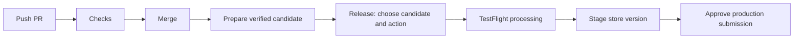

# PicStrip pipeline simplification review — 28 September 2026

The pipeline can be easier to operate while retaining its exact-build verification and approval controls. The highest-value change is a single release entry point that resolves and verifies the candidate automatically. Most of the isolated build, signing, upload, and submission jobs should remain.

Reviewed app main `144747fcf145ab6a256ec1f9eacb9935bb9be480` and its pinned platform `d59e678d4f8f997dfdcbefe065c3c4efa9758f96`. The local source tree matched main. GitHub workflow inventory, recent runs, repository variables, required checks, and environment protections were read live. No workflow or repository setting was changed by this review.

## Current workflows and disposition

| Current workflow | Purpose | Recommendation |
| --- | --- | --- |
| PR Checks | Secret-free policy checks, both supported test toolchains, analysis, lint, localization, developer gems, optional UI smoke, required CI Gate | Keep. Add conservative change classification and make the UI smoke trigger easier to understand. |
| Release Prep | Build and sign the merged source; package store assets; run QA; produce and verify provenance | Keep automatic preparation separate from distribution. Avoid unnecessary candidates for changes outside release inputs. |
| Promote Candidate | Authenticate candidate, upload, wait for Apple, sign processed handoff, optionally publish immutable release | Keep its implementation; replace its technical dispatch form with a release entry point. |
| App Store Deploy | Verify published release, stage exact Apple build/assets, wait for production approval, submit, sign receipt | Keep as the internal deployment worker and explicit recovery path. |
| Verified Metadata Update | Reuse an existing binary with an exact reviewed metadata commit | Preserve the capability; expose it as a Release action instead of a separate routine workflow. |
| Capture Screenshots | Capture, compose, validate, and propose screenshot changes | Keep manual. Full locale capture should not run on every code update. |
| App Store Status | Observe immutable releases and Apple state | Keep optional; use a quieter schedule and focus on active release states. |
| Inspect release controls | Diagnose publisher permissions and protection drift | Keep on demand under Release Maintenance, with its existing restricted job credentials. |
| Encrypt release environment secrets | One-time bootstrap operation | Disable the stale Actions entry. Its YAML is absent from main; its only recorded run succeeded on 19 September. |
| Dependabot Updates / Dependency Graph | GitHub-managed dependency features | Keep. These are dynamic GitHub entries, not duplicate release YAML. |

There are eight maintained app workflow files, one obsolete registered workflow, and two GitHub-managed entries. Reducing visible routine entry points is more useful than minimizing the number of YAML files.

## Highest-value changes

1. **Replace copying hashes with a verified candidate resolver.** The current promotion form asks for candidate ID/digest, optional processed ID/digest, adapter, and a `publish` boolean. Offer explicit actions such as Upload to TestFlight, Publish and stage for App Store review, and Update store metadata. For a new upload, select a successful preparation run by run number or URL. Resolve its unique candidate artifact and API digest, authenticate the signed manifest/provenance, and display version, build, source, and IPA hash. Freeze the resolved identity for all subsequent jobs; never resolve a moving “latest” value after approval. The adapter comes from verified configuration. Advanced recovery can still accept explicit handoff IDs.
2. **Automate the handoff after an explicit release action.** A normal App Store action can upload, wait for processing, publish the immutable evidence, stage the store version, and reach the existing production approval. A TestFlight-only action should end after processing and report a clear resume action for the same build. This removes the routine need to invoke promotion twice and manually carry two ID/hash pairs.
3. **Separate routine operations from recovery controls.** Keep deployment-tag recovery, processed upload receipts, signer allowlists, and exact metadata commits internally. Present those controls only in maintenance/recovery documentation or advanced commands. They protect real failure cases and should not be deleted merely because the normal path does not use them.
4. **Reduce unnecessary triggers.** Every `labeled` and `unlabeled` PR event currently restarts the full workflow, even for labels unrelated to screenshots. Redesign this with the UI-smoke trigger so unrelated labels do not restart CI. For documentation-only changes, skip expensive jobs through a conservative classifier while always running the required outer `CI Gate`. Changes to app code, tests, project configuration, shared code, release tooling, or uncertain paths must keep the relevant full checks. Store metadata/screenshot changes still require their validators.
5. **Scope developer-gem checks.** The app's `Locked gems on macOS` job checks the consumer Gemfile; shared QA installs the platform Gemfile. They have separate ownership, so deleting the app check outright would lose coverage. Run it for Gemfile/lockfile, Ruby, Fastlane, relevant script/workflow, and platform-pin changes; accept an intentional skip in the outer gate for unrelated changes.
6. **Quiet status observation.** In the latest 35-run sample, 24 runs were App Store Status. The latest observer job took 71 seconds and installed Ruby tooling and verification tools. The observer currently examines up to ten immutable releases without first excluding finished releases. Prefer a daily or six-hour baseline, more frequent checks while Apple review/phased rollout is active, and manual refresh. Report meaningful transitions rather than requiring users to inspect repeated unchanged artifacts.
7. **Retire temporary replacement behavior after the 1.7.0 transition.** `replacement_release` intentionally pins the marketing version to 1.7.0 and forces `will_release=true`. Consequently every main push currently qualifies for another candidate, including housekeeping changes. Keep it until the replacement is safely staged/accepted; remove it in a reviewed follow-up before normal version advancement. Even without the override, unreleased commits accumulate since the last stable tag, so path classification is still useful.
8. **Consolidate legacy local release logic.** The consumer still has its own `scripts/semantic_dry_run.mjs` and tests, while hosted preparation uses the platform implementation. The local copy does not implement the replacement-release policy. Replace it with a pinned-platform wrapper or remove it together with its documented commands, tests, and unused dependencies. Audit local signing/build lanes separately; do not remove useful developer commands merely because hosted release jobs use platform lanes.

## Jobs worth retaining

- Primary and compatibility tests: cover different configured toolchains/runtimes. Keep them for app changes and candidate validation. A matrix can reduce YAML repetition but will not itself reduce runtime.
- Lint, localization, static analysis, workflow policy, metadata validation: independent inexpensive failure detection. Keep the required outer `CI Gate` reporting for every PR. The inner QA gate can be given a clearer name without changing the required check.
- QA on the merged candidate source: PR checks alone are not equivalent evidence for the exact main commit. Keep candidate-specific QA unless a future evidence-reuse design rigorously binds equivalent source and configuration.
- Parallel signed archive and QA: already the right arrangement for elapsed time. Do not make compilation wait for tests to finish, and do not upload until both succeed.
- Separate compilation, evidence signing, isolated SLSA generation, verification, Apple upload, publication, staging, and submission: these have different credentials, trust boundaries, runner needs, or recovery checkpoints. Hide their complexity in the platform rather than flattening them into one privileged job.
- Operation receipts and readback: prevent duplicate or conflicting Apple mutations on retries and bind the processed build to the original IPA.

The recent dependency-update PR completed in about 7 minutes 21 seconds. Its developer-gem job took 49 seconds; the two test jobs took about 6–7 minutes each in parallel. Job-count reduction alone will not materially shorten the critical path. These are individual observations, not a performance benchmark or projected savings.

## Proposed operator experience

TestFlight-only stops at processing. Screenshots remain a separate content-authoring workflow. Metadata updates reuse an existing verified build through the same Release entry point. Status and protection diagnostics move to Release Maintenance. PR Checks and Release Prep remain automatic; deployment remains an internal tag-scoped worker.

A single operator entry point does not mean a single workflow execution or runner job. The current staging and production environments accept `v*` tags, whereas preparation and promotion run on main. Reusable workflows inherit the caller's GitHub context, so directly nesting deployment under a main-only release caller would not satisfy these restrictions. Preserve the authenticated tag handoff or explicitly redesign and test the environment policy; do not quietly widen production access to main.

## Implementation order and acceptance

1. Finish or merge the reviewed companion platform PR 30; the app currently pins its unmerged commit. Preserve the already verified build 86.1 and its producer approval during any tooling change.
2. Submit a small housekeeping PR: naming/documentation, conservative CI classification, developer-gem conditions, status cadence, and the local version-analysis wrapper. Update the policy tests alongside trigger/gate changes. Disable the obsolete registered workflow separately; do not delete its audit history.
3. Add the platform candidate resolver and explicit Release actions, then update the app caller. Keep backend verification and protected deployment jobs. Include negative tests for wrong source, failed/in-progress run, multiple or expired candidates, digest mismatch, unapproved producer, and unrelated processed handoff. Test retry/resume without rebuilding, resigning, or duplicate upload. Metadata mode must remain bound to an exact reviewed main-ancestor commit.
4. Validate required-check behavior for docs-only, app, metadata, screenshot, dependency, label, draft, and failed-classifier cases. Run workflow policy, actionlint, and platform Linux/macOS tests. Exercise a signed consumer candidate through verification before any separately approved Apple mutation.
5. Retire the 1.7.0 replacement override only when that release transition is complete. Keep old producer approvals needed for retained release recovery; prune them only under an explicit support/retention policy.

No reduction to the supported test matrix, signing isolation, artifact verification, or production approval is necessary for this cleanup.

## Evidence

- [App workflow source at reviewed main](https://github.com/northcutted/picstrip/tree/144747fcf145ab6a256ec1f9eacb9935bb9be480/.github/workflows)
- [Pinned platform workflow implementations](https://github.com/northcutted/ios-release-workflows/tree/d59e678d4f8f997dfdcbefe065c3c4efa9758f96/.github/workflows)
- [Replacement-aware version analysis](https://github.com/northcutted/ios-release-workflows/blob/d59e678d4f8f997dfdcbefe065c3c4efa9758f96/scripts/semantic_dry_run.mjs)
- [Current observer behavior](https://github.com/northcutted/ios-release-workflows/blob/d59e678d4f8f997dfdcbefe065c3c4efa9758f96/scripts/ci/observe.py)
- [Successful exact-build preparation](https://github.com/northcutted/picstrip/actions/runs/36361500843)
- [Dependency-update PR timing sample](https://github.com/northcutted/picstrip/actions/runs/36361648024)
- [Observer timing sample](https://github.com/northcutted/picstrip/actions/runs/36479545600)
- [One-time secret bootstrap run](https://github.com/northcutted/picstrip/actions/runs/35446710993)
- [Open companion platform PR](https://github.com/northcutted/ios-release-workflows/pull/30)
- GitHub documents that reusable workflows inherit the [caller's GitHub context](https://docs.github.com/en/actions/reference/workflows-and-actions/reusing-workflow-configurations) and that [deployment ref restrictions apply to environments](https://docs.github.com/en/actions/reference/workflows-and-actions/deployments-and-environments).
- GitHub warns that [skipping required workflows through path filters leaves checks pending](https://docs.github.com/en/pull-requests/how-tos/merge-and-close-pull-requests/troubleshooting-required-status-checks). Keep the required gate running and perform classification inside the workflow.
