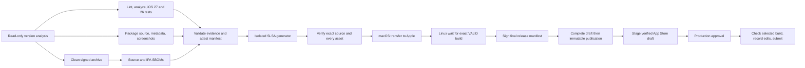

# Release operations and evidence

The pipeline builds one IPA, verifies its evidence before upload, and submits only the App Store Connect build recorded in the signed release manifest. Production approval remains a human decision. The initial rollout defaults to verification only: `RELEASE_DISTRIBUTION_ENABLED` must explicitly equal `true` before any TestFlight transfer, release publication, staging, or review submission.

## Workflow and toolchain



`scripts/ci/config.json` is the toolchain/device/locale authority. Release archives, static analysis, iOS 27 tests, and screenshots require the hosted `xcode-27` image with **Xcode 27.0, build 27A266a**, iPhoneOS 27.0 SDK, and iOS 27.0 simulator runtime. A mismatch fails instead of falling back. The separate iOS 26 compatibility tests use `macos-26`, Xcode 26.6 build 17F113 and the iOS 26.5 runtime. They check behavior compiled with the older toolchain; the release archive itself always uses Xcode 27. A device test of the production IPA on iOS 26 remains part of candidate validation.

Tests use iPhone 17. Screenshots capture iPhone 18 Pro Max and iPad Pro 13-inch (M5), resolving UDIDs within the pinned runtime. Existing iPhone 17 Pro Max marketing images remain accepted in the same configured screenshot size class. The validator requires all five screens on both device classes in all 16 locales: 160 images. It rejects missing files, stale extras, LFS pointers, and wrong dimensions.

Ruby is exactly pinned by `.ruby-version` (3.4.10). Gem dependencies and checksums are frozen in `Gemfile.lock`, and PR checks load them on both Linux and macOS. Node release tools use `npm ci --ignore-scripts`; screenshot Python dependencies use `pip --require-hashes`. SwiftLint, Syft, and actionlint installers verify pinned archive digests. Dependabot proposes updates; a toolchain image change needs an explicit reviewed config update and passing QA.

`PR Checks` always reports `CI Gate`, even when another job fails or is skipped. Required jobs cover workflow policy, release regression tests, locked gems, SwiftLint, analysis, and both simulator test suites. Add the `screenshots` label for an en-US capture smoke test. PR jobs receive no deployment environments, signing keys, App Store credentials, or attestation permissions.

## Evidence contract

The schema-2 `release-build-manifest.json` binds the repository, main source SHA, version, Apple build number, workflow run/attempt, IPA digest, and every required artifact's SHA-256 and byte count. Apple build numbers are `<workflow run number>.<build attempt>`. The build number remains unchanged when rerunning only downstream failed jobs.

Required artifacts include the IPA, build/signing environment records, bundle inventory, actual QA reports and summary, separate source/tool and shipped IPA SPDX SBOMs, source archive, release notes, metadata archive, screenshots archive, and image inventory. Producer checksums are checked before signing. Test evidence must contain actual executed test cases, with zero failures, for both OS jobs. Missing reports and zero-test successes fail release preparation.

The IPA inspector checks the app and extension bundle IDs, matching versions/builds, Xcode/SDK identities, code signatures, embedded App Store profiles and expiry, profile-authorized signing certificates, team/app-group entitlements, privacy manifests, export-compliance flags, and matching dSYM UUIDs. `signing-env.json` records the exact certificate-repository commit, actual signing certificate fingerprints, and profile identities. Match imports from that local snapshot, using a random temporary keychain password; cleanup removes the temporary keychain, newly imported profiles, SSH identities, and snapshot. Compilation receives no App Store API key.

After Apple reports the exact uploaded build as `VALID`, `release-manifest.json` additionally binds its App Store build ID, processing receipt, build manifest, attestations, and isolated SLSA provenance. A separate job signs this final manifest using predicate `https://northcutted.github.io/picstrip/attestations/release/v2`.

The publisher creates or resumes a draft, rejects conflicting asset names/digests or source identities, uploads missing assets, reads back every digest, and only then publishes. Immutable releases must already be enabled. Deployment is triggered by `release.published`; it does not poll for assets after a tag push.

The deployment verifier authenticates the manifest's expected workflow, source ref, exact source and signer commit, and hosted runner identity before trusting its fields. It verifies isolated SLSA provenance for both the build manifest and IPA, including workflow entrypoint, source SHA, producing run, and build attempt. All manifest-listed assets are checked before extraction. Extraction accepts only ordinary files/directories under the expected metadata/screenshots prefix, rejecting traversal and links. The extracted screenshot inventory must equal the signed inventory. The upload job repeats verification and hashes the IPA immediately before transfer.

## SLSA Build L3 scope

This is a design targeting defensible **SLSA Build L3 for the GitHub-produced IPA**, not a certification and not a claim about Apple's redistributed app digest. Native GitHub attestations alone do not establish Build L3. The isolated upstream generator supplies the Build L3 provenance boundary.

| Requirement/control | Implementation and limit |
| --- | --- |
| Hosted, isolated builds | Standard ephemeral GitHub-hosted runners; no self-hosted runners or restored DerivedData/executable dependency caches in signing/evidence jobs. |
| Isolated provenance generation | `slsa-framework/slsa-github-generator` reusable generic generator; compilation lacks OIDC and attestation write permission. Evidence-signing jobs do not compile application code. |
| Authenticated provenance | Sigstore signatures and transparency evidence; verification pins repository, workflow, source ref/commit, run context, and subject digests. |
| Distribution and verification | Provenance and signed manifests ship with the immutable release; TestFlight and App Store handoffs fail closed on mismatches. |
| Source/release authorization | PR plus `CI Gate`, release-App-only tag creation, immutable published assets, environment ref restrictions, and production approval. These live settings must be applied after CI passes. |
| Dependency visibility | Source/tool dependencies and shipped components are distinguished. No embedded runtime libraries is explicitly represented rather than inventing package inventory. |

The generator's `@v2.1.0` reference is a deliberate exception to full action SHA pins: the upstream verifier requires a full version tag for recognized builder identity. The workflow-policy test permits only this exact exception. Review upstream generator updates separately; do not replace its reference mechanically with a SHA.

Trust remains in GitHub's hosted platform, the approved main workflow/source, maintainers and the release App, Apple signing infrastructure, and reviewed tool/dependency inputs. Provenance authenticates origin and evidence; it does not prove source code is benign or that Apple preserves IPA bytes. App Store Connect does not expose the uploaded IPA digest for independent readback: the final manifest records the trusted uploader's association between the verified transfer and Apple's unique version/build ID.

References: [SLSA Build requirements](https://slsa.dev/spec/v1.2/build-requirements), [generator reference requirements](https://github.com/slsa-framework/slsa-github-generator#referencing-slsa-builders-and-generators), [immutable releases](https://docs.github.com/en/code-security/concepts/supply-chain-security/immutable-releases), [hosted Xcode image](https://github.com/actions/runner-images/blob/main/images/macos/xcode-27-arm64-Readme.md).

## Repository setup and rollout

1. Merge only after the new `CI Gate` passes for the candidate. Before distribution, use a main-branch verification-only run. It includes signing, complete QA, evidence generation, and verification, but no upload/publication. Review the resulting environment, inventory, dSYMs and provenance artifacts.
2. Apply repository controls using the passing PR run and the numeric ID of the private `picstrip-release-bot` GitHub App. Preview first; the script requires that run to match the current committed revision and that production approval already exists. Main requires a PR and `CI Gate` with zero mandatory approving reviewers, preserving solo-maintainer merging. The script enables immutable releases and Dependabot security updates, restricts release tags to the App, sets environment refs, and leaves distribution disabled.

   ```bash
   python3 scripts/ci/configure_repository.py --ci-run CI_RUN_ID --release-app-id APP_ID
   python3 scripts/ci/configure_repository.py --ci-run CI_RUN_ID --release-app-id APP_ID --apply
   ```

3. Scope secrets to environments before claiming full credential isolation. GitHub cannot disclose existing secret values for automated migration; enter the original values securely into the destination environments, verify a candidate, then remove the repository-wide copies. Never put values in command arguments or logs.

   | Environment | Allowed ref | Secrets/capability |
   | --- | --- | --- |
   | `signing` | main branch | `MATCH_SSH_PRIVATE_KEY`, `MATCH_PASSWORD`; certificate deploy key should be read-only |
   | `testflight` | main branch | `APP_STORE_CONNECT_API_KEY_ID`, `APP_STORE_CONNECT_API_KEY_ISSUER_ID`, `APP_STORE_CONNECT_API_KEY_CONTENT`; use an upload-capable key with the least required role |
   | `release-publishing` | main branch | `RELEASE_APP_ID`, `RELEASE_APP_PRIVATE_KEY`; token requests contents write and administration read on this repository (the latter checks immutable-release settings) |
   | `screenshot-publishing` | main branch | Release App credentials; installation must allow contents and pull-request write |
   | `app-store-staging` | release tags `v*` | App Store API credentials for draft metadata |
   | `production` | release tags `v*` | App Store API credentials for submission; retain the existing required reviewer |

4. Run verification explicitly from main after merge:

   ```bash
   gh workflow run main.yml --ref main -f mode=verify-only
   ```

5. After verification succeeds, enable `RELEASE_DISTRIBUTION_ENABLED=true` and dispatch `mode=release` for one eligible Conventional Commit candidate. Inspect the exact TestFlight build, test the production IPA's supported iOS 26 behavior, and inspect the staged App Store draft. Use the existing production approval only after this inspection. Submission preserves manual metadata edits while rejecting a substituted build. Apple approval retains automatic, phased release.
6. Record five comparable completed runs before reporting a speedup. Initial structural savings are estimated at roughly 2–3 minutes, not measured. Separate queue time, execution, Apple processing, and production approval delay. Archive creation now overlaps QA; source packaging also starts independently. TestFlight processing waits on Linux instead of occupying macOS.

The live branch/tag/environment settings are external state; this document does not imply the setup script has been applied or a candidate has shipped. Distribution is intentionally disabled when the repository variable is absent.

## Retry and recovery

Use **Re-run failed jobs** on the original release-preparation run. Successful build/evidence jobs and their artifact names stay tied to the original producing attempt. A failed Apple-processing job resumes lookup of the same version/build. Never choose **Re-run all jobs** to retry metadata or submission: it creates another build attempt.

If transfer fails ambiguously and that version/build is already visible in Apple, the uploader refuses another transfer. Inspect the original upload evidence and Apple state before resuming; the pipeline does not guess that an unrelated existing build came from its IPA. Missing/expired evidence requires explicit investigation, not an automatic rebuild masquerading as a deployment retry.

Publication retries reuse the draft and matching assets. Conflicting source, build, or asset hashes stop publication. Already-published immutable releases can be verified but never overwritten. For staging or review failures, rerun the failed deployment jobs or dispatch `app-store-deploy.yml` with both its selected ref and `release_tag` set to the same immutable release tag. No rebuild is involved. The staging lane detects an already-submitted exact build and preserves it; the review lane checks the selected build again immediately before submission and recognizes already-submitted states.

For metadata changes, merge the text changes by PR, then dispatch `metadata-only.yml` on the immutable release tag. It consumes only the metadata directory from main, while executing the verified release's code and retaining its exact build identity. `submit_for_review=true` routes through the same `production` environment as normal deployment. All App Store mutation jobs share one concurrency group with cancellation of running jobs disabled. GitHub concurrency keeps at most one pending job, so a newer queued request can supersede an older pending request; rerun a superseded request deliberately.

Staging records a public-metadata snapshot. Immediately before submission the lane records the selected build, final metadata/screenshots/app information, and differences since staging. Review credentials/contact information are excluded. The submission receipt is retained as a separate Actions artifact for 90 days; it is never appended to the immutable release. Download it for longer-term retention. Archive/dSYM diagnostics also have 90-day Actions retention and are not GitHub Release assets; public-repository Actions artifacts are not a private storage boundary.

## Local verification and benchmarks

Install the pinned Ruby version, `bundle install`, and `npm ci --ignore-scripts`, then run:

```bash
npm run check:workflows
npm run test:ci
actionlint
```

Tests cover Conventional Commit version rules, reachable tags, read-only analysis, workflow privilege/gate regressions, tampered/missing assets, source/workflow mismatch, missing/zero/failed QA reports, screenshot coverage, unsafe archives, processing timeouts, and substituted App Store build identities.

To verify a downloaded release, use a trusted checkout of this verifier and the independently selected source commit/tag:

```bash
gh release download vX.Y.Z --repo northcutted/picstrip --dir release-assets
python3 scripts/ci/verify_release.py release-assets --source FULL_SOURCE_SHA --tag vX.Y.Z --final
```

Install `gh` with artifact attestation support and the upstream `slsa-verifier` first. Successful verification authenticates the final manifest and original build provenance, then checks every bound asset.

The manual `PR Checks` workflow accepts `test_workers=1` or `2` for benchmarking. Production remains serial until five successful comparable runs show reliable complete test execution and at least 15% lower median test duration with two workers. Failed/flaky trials must also be considered; do not report only successful runs as evidence of reliability.

```bash
python3 scripts/ci/benchmark.py RUN_1 RUN_2 RUN_3 RUN_4 RUN_5
python3 scripts/ci/benchmark.py RUN_1 RUN_2 RUN_3 RUN_4 RUN_5 --baseline-test-seconds SERIAL_MEDIAN
```

Screenshot refreshes use `Capture Screenshots` on main. The workflow validates input locales, captures with the pinned toolchain, composes the current five-screen sequence, validates the complete inventory, and opens a PR based on the exact capture commit. Review the images before merging. It never directly pushes to main or disables system certificate revocation checks.
