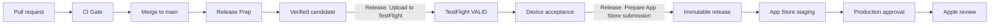

# CI/CD: from a change to the App Store

**Merge a checked PR → inspect its prepared build → choose when to release it.** PicStrip prepares release candidates automatically when needed. Uploading to TestFlight is deliberate, and App Store submission still requires production approval.

## Start with your task

| I want to… | Start here |
| --- | --- |
| Push an app update | Open a PR; wait for **CI Gate**, then merge. See [which checks run](ci-cd/reference.md#which-checks-run). |
| Test a release on a device | [Upload an exact candidate to TestFlight](ci-cd/operations.md#send-a-build-to-testflight). |
| Ship a tested build | [Prepare the App Store submission](ci-cd/operations.md#prepare-an-app-store-submission). |
| Change store text without a new binary | [Update metadata](ci-cd/operations.md#update-store-metadata). |
| Refresh store images | [Capture screenshots and review their PR](ci-cd/operations.md#refresh-screenshots). |
| Recover a failed operation | [Retry the original run](ci-cd/operations.md#recover-a-failed-run). |
| Understand the design | [Architecture and trust boundaries](ci-cd/architecture.md). |
| Change the pipeline or its docs | [Maintenance guide for humans and agents](ci-cd/maintenance.md). |
| Find exact inputs, pins, or jobs | [Generated reference](ci-cd/reference.md) · [JSON index](ci-cd/reference.json). |

## The journey

```mermaid
flowchart LR
    PR[Pull request] --> Gate[CI Gate]
    Gate --> Main[Merge to main]
    Main --> Prep[Release Prep]
    Prep --> Candidate[Verified candidate]
    Candidate -->|Release: Upload to TestFlight| TF[TestFlight VALID]
    TF --> Accept[Device acceptance]
    Accept -->|Release: Prepare App Store submission| Publish[Immutable release]
    Publish --> Stage[App Store staging]
    Stage --> Approval[Production approval]
    Approval --> Review[Apple review]
```

**Release Prep** builds, signs, tests, packages, and verifies evidence. Signing and QA run in parallel. An automatic run may intentionally have no candidate when changed paths or version policy do not require one. A manual run requests a complete candidate. Read its summary before selecting it.

**Release** takes an exact successful preparation or TestFlight run URL. It authenticates that selection and keeps the same binary throughout promotion. Retain the URL: it is the handle you use for the next step.

**App Store Deploy (internal)** stages the published release, then waits for approval before requesting Apple review. Choosing **Prepare App Store submission** can therefore start a deployment waiting for your approval; the workflow's success is not evidence of an approved or released App Store version.

## The everyday loop

1. Open a PR and describe the user-visible change. Review code, store text, and changed screenshots together. `CI Gate` is the required result; it checks that every selected job passed and every skip was intentional.
2. Merge after checks pass. Documentation-only changes skip simulators and automatic preparation. App changes run both test toolchains and UI smoke; unknown/tooling changes request everything.
3. For a release, open the successful **Release Prep** run and inspect the candidate's source, version, build, and evidence. Use **Release → Upload to TestFlight** with that run URL.
4. Test that exact build on devices. Then use **Release → Prepare App Store submission** with the successful TestFlight run URL. Review staging before approving production submission.

Use [GitHub Actions](https://github.com/northcutted/picstrip/actions) for current runs and approvals. The reference describes checked-in configuration; it cannot confirm live repository controls or Apple state.

## Reading map

Read this page for orientation, [operations](ci-cd/operations.md) while shipping, and [architecture](ci-cd/architecture.md) when changing release behavior. Agents can start with the [maintenance recipe](ci-cd/maintenance.md#agent-reading-and-editing-recipe) and read only the relevant source files.

Dated [rehearsal evidence](archive/releases/1.7.0/release-rehearsal-2026-09-19.md) and [1.7.0 acceptance evidence](releases/1.7.0-acceptance.md) record earlier observations. They are not live release status. The acceptance checklist remains useful for device validation; confirm completion against the selected build before submission.
